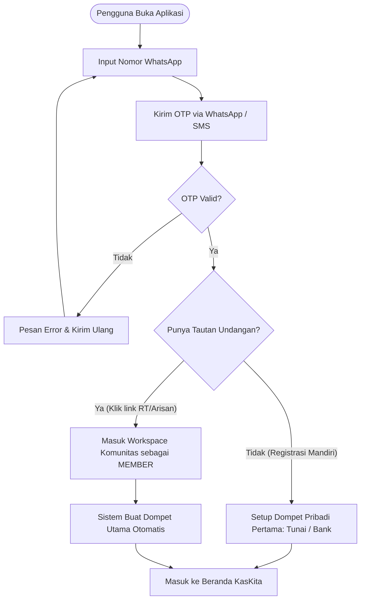
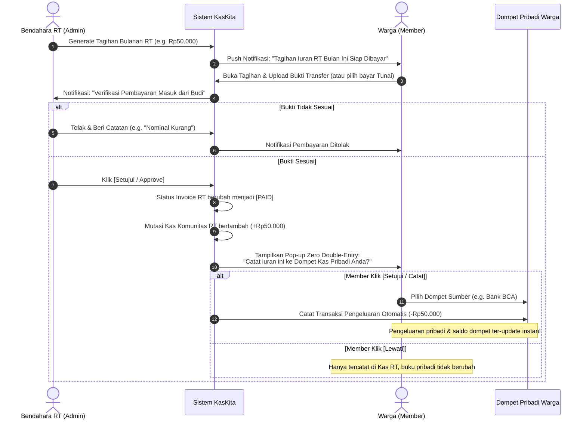
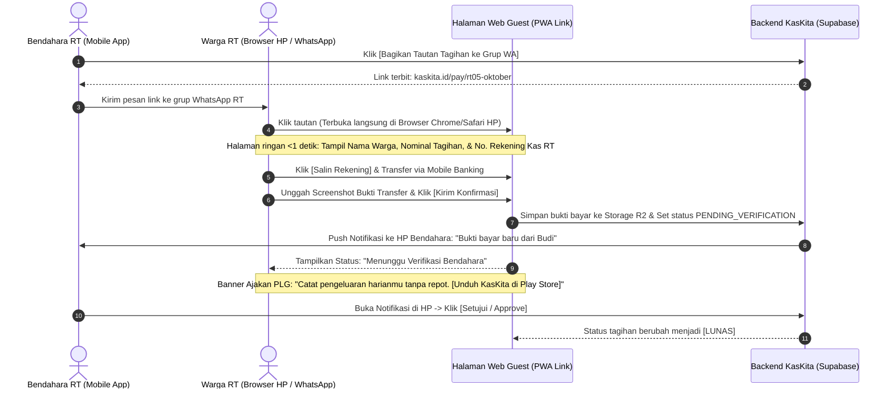

# Tahap 2: Navigasi, Information Architecture & Core User Flows — KasKita

> [!abstract] Ringkasan Navigasi & Alur
> Dokumen ini memetakan **Information Architecture (IA)**, struktur sitemap mobile & web, **4 Core User Flows** dengan integrasi mesin *Zero Double-Entry*, serta matriks hak akses visual (**Role-Based Access Control / RBAC**) pada antarmuka pengguna KasKita.

---

## BAGIAN 1: INFORMATION ARCHITECTURE (IA) & SITEMAP

Sesuai paradigma **Hub & Spoke**, aplikasi KasKita mengutamakan kenyamanan penggunaan harian untuk mencatat keuangan pribadi, sementara ruang komunitas (RT, Arisan, Utang Piutang) dapat diakses dengan mudah melalui satu tab sentral.

### 1. Struktur Navigasi Global (Global Frame)
* **Header Bar (Atas):**
  * **Saldo Bersih (Net Worth):** Akumulasi total saldo dari seluruh dompet aktif pengguna.
  * **Pusat Notifikasi (Icon Bell):** Pengingat tagihan iuran, jadwal arisan, jatuh tempo utang, dan konfirmasi verifikasi admin.
  * **Profil Akun:** Pengaturan akun, ganti nomor WA/email, ganti PIN/biometrik, dan ekspor data.
* **Bottom Navigation Bar (Tampilan Mobile 5-Tab):**

```
┌─────────────────────────────────────────────────────────────────────────┐
│                           APLIKASI KASKITA                              │
└────────────────────────────────────┬────────────────────────────────────┘
                                     │
   ┌───────────────┬─────────────────┼─────────────────┬───────────────┐
   ▼               ▼                 ▼                 ▼               ▼
[TAB 1]         [TAB 2]           [TAB 3]           [TAB 4]         [TAB 5]
BERANDA        TRANSAKSI     SOSIAL & KOMUNITAS     ANGGARAN        LAPORAN
(Daily Hub)   (Ledger View)    (The Spokes Hub)    & KALENDER     (Analytics)
   │               │                 │                 │               │
   ├─ Multi-       ├─ Riwayat        ├─ Grup RT/RW     ├─ Batas Limit  ├─ Pie Chart
   │  Dompet       │  Mutasi         │  • Tagihan      │  Bulanan      │  Pengeluaran
   ├─ Widget       ├─ Filter         │  • Kas Warga    ├─ Kalender     ├─ Tren Arus
   │  Kewajiban    │  Dompet         ├─ Grup Arisan    │  Jatuh        │  Kas Harian
   │  Sosial       ├─ Filter         │  • Putaran      │  Tempo        └─ Ekspor PDF
   └─ Tombol (+)   │  Kategori       │  • Kocokan      └─ Pengingat       Personal
      Cepat        └─ Search         └─ Utang Piutang     Harian
                                        • Saya Pinjam
                                        • Piutang Teman
```

### Antarmuka Adaptif Tab 3: Gaya WhatsApp Group Info
Antarmuka Tab 3 beradaptasi otomatis berdasarkan peran pengguna tanpa perlu berpindah aplikasi atau membuka web terpisah:
* **Jika Pengguna adalah ADMIN / BENDAHARA:**
  * Tombol Aksi Cepat Admin langsung terlihat di bagian atas: `[🔗 Undang via WA]`, `[📝 Terbitkan Tagihan]`, `[🎲 Kocok Arisan]`.
  * Banner Verifikasi Mengambang: Menampilkan badge jumlah warga yang menunggu konfirmasi bukti bayar (misal: *"⚠️ 3 Bukti Bayar Menunggu Review"*).
  * Tombol `[+ Catat Kas Keluar]` untuk mencatat mutasi pengeluaran kas RT langsung dari HP.
* **Jika Pengguna adalah WARGA / MEMBER:**
  * Tombol admin disembunyikan secara bersih (*zero clutter*).
  * Menampilkan Kartu Tagihan Saya: Rincian iuran bulan berjalan dengan tombol `[Bayar & Upload Bukti]`.
  * Menampilkan Ringkasan Transparansi Kas RT dan Riwayat Pemenang Arisan (*Read-Only*).

---

## BAGIAN 2: ALUR PENGGUNA UTAMA (CORE USER FLOWS)

Berikut adalah diagram logika langkah demi langkah untuk interaksi paling esensial dalam aplikasi KasKita:

---

### FLOW 1: Onboarding Pengguna & Pembagian Peran

Alur ketika pengguna baru mengunduh aplikasi atau membuka tautan undangan dari grup WhatsApp:



---

### FLOW 2: Siklus Iuran Warga & Zero Double-Entry Engine

Alur lengkap dari penerbitan tagihan bulanan oleh bendahara hingga pencatatan otomatis ke buku kas pribadi warga:



---

### FLOW 3: Siklus Arisan Digital & Tarikan Dana

Alur pengundian arisan yang adil dan transparan bagi seluruh peserta:

```mermaid
graph TD
    OpenArisan[Admin Buka Halaman Grup Arisan] --> CheckDues[Sistem Tampilkan Status Setoran Anggota]
    CheckDues --> UnpaidAlert{Ada yang belum setor?}
    UnpaidAlert -- Ya --> SendNudge[Kirim Tombol Nudge / Colek via WA]
    UnpaidAlert -- Tidak / Tetap Lanjut --> TriggerDraw[Admin Klik Tombol 'Kocok Arisan']
    
    TriggerDraw --> FilterSlot[Sistem Filter: Peserta Aktif & BELUM PERNAH Menang]
    FilterSlot --> RandomizerAnim[Animasi Pengacakan Digital Randomizer]
    RandomizerAnim --> WinnerSelected[Terpilih 1 Pemenang Putaran Ini]
    
    WinnerSelected --> LockWinner[Kunci Data Pemenang di Riwayat Putaran]
    WinnerSelected --> BroadcastWin[Kirim Notifikasi Pemenang ke Seluruh Anggota Grup]
    WinnerSelected --> WinnerPrompt[Pemenang Menerima Notifikasi Dana Cair]
    WinnerPrompt --> AutoIncome[Opsi Pemenang: 'Catat Tarikan Arisan sebagai Pemasukan Pribadi (+)']
```

---

### FLOW 4: Pencatatan Utang Piutang & Pengingat Anti-Sungkan

Alur pelacakan pinjaman santai tanpa rasa canggung (*frictionless*):

```
[PENGGUNA: Catat Transaksi Baru di Tab Sosial]
   │
   ├── Tipe A: [Saya Berutang (Payable)]
   │     └── Input: Nominal, Nama Peminjam, Dompet Tujuan Terima Uang, Tanggal Jatuh Tempo.
   │
   └── Tipe B: [Piutang Teman (Receivable)]
         └── Input: Nominal, Nama Teman, Nomor WhatsApp, Tanggal Janji Bayar.
               │
               ▼
[SISTEM: Monitor Jatuh Tempo Otomatis]
   │
   ├── H-3 & H-1 Jatuh Tempo:
   │     └── Notifikasi ke Pemilik: "Pinjaman Andi Rp200.000 jatuh tempo besok."
   │           │
   │           ▼
   │     [Klik Tombol: 'Kirim Pengingat WhatsApp']
   │           │
   │           ▼
   │     [Buka WhatsApp Client dengan Pesan Otomatis:]
   │     "Halo Andi, sekadar mengingatkan catatan pinjaman sebesar
   │      Rp200.000 jatuh tempo besok ya. Semoga harimu lancar!"
   │
   ▼
[Saat Andi Membayar]
   │
   ├── Bayar Sebagian (Cicilan) ──> Sisa piutang berkurang otomatis.
   └── Bayar Lunas              ──> Status jadi [LUNAS], prompt:
                                     "Tambahkan Rp200.000 ke Dompet BCA Anda?"
```

---

### FLOW 5: Zero-Install Guest Payment (Warga Bayar via Browser Tanpa Install Aplikasi)

> [!tip] Solusi Mengatasi Keengganan Warga Menginstal Aplikasi Baru
> Tidak semua warga bersedia langsung mengunduh aplikasi native di ponsel mereka hanya untuk membayar iuran bulanan Rp30.000–Rp50.000. KasKita menyediakan alur pembayaran tanpa instalasi (*zero friction*):



---

## BAGIAN 3: MATRIKS HAK AKSES PENGGUNA (UI RBAC MATRIX)

Untuk menjaga privasi dan ketertiban administrasi grup, komponen antarmuka disaring ketat berdasarkan peran pengguna di masing-masing workspace:

| Komponen & Aksi di Layar | Role: OWNER / ADMIN (Bendahara) | Role: MEMBER (Warga / Peserta) |
| :--- | :---: | :---: |
| **Buku Kas & Dompet Pribadi** | Privat (Hanya pemilik akun yang dapat melihat) | Privat (Hanya pemilik akun yang dapat melihat) |
| **Dasbor Kas Bersama RT** | Akses Penuh (Dapat mencatat pengeluaran kas) | Transparansi (*Read-Only*, hanya melihat saldo & mutasi) |
| **Buat Tagihan Iuran Massal** | Tersedia (*Active*) | Tersembunyi (*Hidden*) |
| **Verifikasi Bukti Transfer Warga** | Tersedia (Tombol *Approve / Reject*) | Tersembunyi (*Hidden*) |
| **Tombol Unggah Bukti Bayar** | Tersembunyi di kas RT (Admin verifikasi) | Tersedia di kartu tagihan masing-masing |
| **Tombol "Kocok Arisan"** | Tersedia (*Active*) | Tersembunyi (*Hidden*) |
| **Kirim Nudge/Colek Tagihan** | Tersedia (Bisa kirim pengingat ke penunggak) | Tersembunyi (*Hidden*) |
| **Ekspor Rekap Laporan Kas (PDF/Excel)** | Laporan Lengkap (Nama warga, detail tanggal & nominal) | Laporan Ringkasan (Arus kas masuk & keluar total) |
| **Kelola Daftar Anggota Komunitas** | Bisa menambah, menghapus, atau edit peran | Hanya melihat daftar nama warga |

---
*Langkah berikutnya:* Pelajari skema basis data dan arsitektur backend pada [[bisnis/kaskita/03-arsitektur-sistem-dan-database|03-arsitektur-sistem-dan-database.md]].
