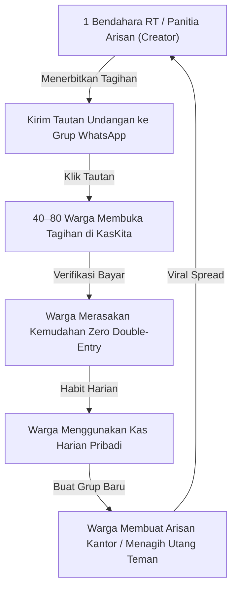

# Tahap 5: Strategi Produk Hub & Spoke, Retensi Harian & Viral Loops — KasKita

> [!abstract] Inti Strategi Produk
> Dokumen ini membedah cetak biru strategis **Hub & Spoke** yang menjadi diferensiasi mutlak (*unfair advantage*) KasKita. Mengubah orientasi produk dari sekadar "alat iuran RT" menjadi **"Aplikasi Pengatur Keuangan Pribadi Harian yang Berinteraksi Otomatis dengan Lingkungan Sosial Pengguna"**.

---

## BAGIAN 1: RASIONALITAS PERUBAHAN STRATEGIS (THE PIVOT)

### 1. Jebakan Frekuensi Buka Rendah (The Low Frequency Trap)
Jika KasKita hanya berfokus pada manajemen iuran RT atau arisan warga:
* Pengguna hanya membuka aplikasi **1–2 kali per bulan** (saat membayar tagihan setelah gajian).
* Biaya akuisisi pengguna (*Customer Acquisition Cost / CAC*) menjadi mahal karena harus meyakinkan pengurus RT satu per satu melalui birokrasi perumahan.
* Tingkat retensi Day-30 anjlok di bawah **8%**, menyebabkan aplikasi rentan di-uninstall karena dianggap tidak memberi nilai tambah harian.

### 2. Kelemahan Kompetitor Personal Finance
Sebaliknya, jika hanya membuat aplikasi catatan keuangan pribadi biasa (seperti Money Lover, Spendee, atau Catatan Keuangan):
* Pengguna mengalami **kelelahan mencatat manual (*manual entry fatigue*)**.
* Aplikasi tidak memiliki kesadaran terhadap kewajiban sosial pengguna (iuran RT, arisan keluarga, utang teman), sehingga pengguna harus mencatat transaksi yang sama berkali-kali.

### 3. Sinergi Hub & Spoke: Mengunci Retensi Harian
Dengan memposisikan **Buku Kas Pribadi sebagai Poros (Hub)** dan **Urusan Sosial sebagai Cabang (Spokes)**:
1. Pengguna membuka KasKita **setiap hari** untuk mencatat pengeluaran makan, kopi, bensin, dan memantau saldo dompet.
2. Ketika ada transaksi di komunitas (iuran RT diverifikasi bendahara atau arisan cair), data langsung **mengalir otomatis** ke buku kas pribadi pengguna tanpa input ulang.
3. Dampak: **DAU melonjak, Day-30 Retention diproyeksikan naik hingga $> 35\%$, dan retensi pengguna terkunci kuat.**

---

## BAGIAN 2: ARSITEKTUR "HUB & SPOKE" & ZERO DOUBLE-ENTRY ENGINE

```
                   ┌──────────────────────────────┐
                   │    SPOKE 1: UTANG PIUTANG    │
                   │   (Teman bayar utang Rp100k) │
                   └──────────────┬───────────────┘
                                  │ (+) Saldo masuk
                                  ▼
┌──────────────────┐    ┌───────────────────────────────────┐    ┌──────────────────┐
│  SPOKE 2: IURAN  ├───>│        CORE ENGINE (HUB)          │<───┤ SPOKE 3: ARISAN  │
│ (Bayar iuran RT  │(-) │       KEUANGAN PRIBADI SAYA       │(+) │ (Menang kocokan  │
│      Rp50k)      │    │ (Dompet, Cashflow, Laporan Harian)│    │   tarikan Rp2jt) │
└──────────────────┘    └───────────────────────────────────┘    └──────────────────┘
                                  ▲
                                  │
                   ┌──────────────┴───────────────┐
                   │    PENGELUARAN RUTIN HARIAN  │
                   │  (Makan, Bensin, Kopi, Belanja)│
                   └──────────────────────────────┘
```

### Matriks Pemicu Sinkronisasi Otomatis (Trigger Matrix)

| Peristiwa di Modul Komunal (Spoke) | Aksi Sistem Otomatis ke Kas Pribadi (Hub) | Kategori Default Sistem | Dampak ke Saldo |
| :--- | :--- | :--- | :---: |
| **Bendahara RT menyetujui pembayaran iuran** | Catat transaksi **PENGELUARAN (-)** | `Iuran & Lingkungan` | Saldo dompet terpilih berkurang |
| **Anggota menyetor uang arisan periode ini** | Catat transaksi **PENGELUARAN (-)** | `Arisan & Komunitas` | Saldo dompet terpilih berkurang |
| **Nama anggota keluar saat kocokan arisan digital** | Catat transaksi **PEMASUKAN (+)** | `Tarikan Arisan` | Saldo dompet penerima bertambah |
| **Teman melunasi utang ke pengguna** | Catat transaksi **PEMASUKAN (+)** | `Pelunasan Piutang` | Saldo dompet penerima bertambah |
| **Pengguna mencicil utang ke teman** | Catat transaksi **PENGELUARAN (-)** | `Pembayaran Utang` | Saldo dompet pembayar berkurang |

> [!tip] Kontrol Penuh Pengguna
> Meskipun berjalan otomatis, KasKita tetap memegang prinsip kedaulatan pengguna (*user autonomy*). Setiap aksi sinkronisasi memunculkan prompt persetujuan ramah:  
> *"Iuran RT Rp50.000 telah lunas. Ingin mencatat ke Dompet BCA Anda?" [Ya, Catat] / [Lewati]*. Pengguna juga dapat mengaktifkan fitur *Auto-Sync Always ON* di menu preferensi.

---

## BAGIAN 3: 4 PILAR FITUR INTI KEUANGAN PRIBADI (THE HUB)

1. **Multi-Dompet (Wallets):**
   - Mendukung pemisahan kantong uang riil: *Kas Tunai di Dompet, Bank BCA, Bank Mandiri, GoPay, OVO, ShopeePay*.
   - Saat membayar tagihan iuran atau cicilan utang, pengguna cukup memilih sumber dompet dalam 1 kali klik.
2. **Kategori Cerdas:**
   - Kategori harian standar: Makanan, Transportasi, Belanja Harian, Tagihan Listrik/Air.
   - Kategori otomatis komunal: *Iuran Warga RT, Arisan, Cicilan Utang*.
3. **Budgeting & Batas Pengeluaran Bulanan:**
   - Menetapkan limit anggaran per kategori pengeluaran (misal: Budget Sosial Rp400.000/bulan).
   - Indikator progres visual (*Progress Bar* warna hijau-kuning-merah) memperingatkan pengguna jika tagihan RT dan arisan bulan ini mulai mendekati batas pagu.
4. **Kalender Kewajiban Finansial (Financial Obligation Calendar):**
   - Dasbor kalender terpadu yang menampilkan tanggal jatuh tempo iuran RT, jadwal kocokan arisan, tanggal bayar utang, serta tagihan rutin pribadi.

---

## BAGIAN 4: VIRAL ENGINE (BOTTOM-UP PRODUCT-LED GROWTH)

KasKita mengonversi setiap kelompok komunitas menjadi mesin akuisisi pengguna mandiri:



### Keunggulan Alur Akuisisi Warga (The Zero-Install Funnel):
1. **Zero Barrier to Pay (Web Guest Link):** Warga tidak dipaksa mengunduh aplikasi di awal. Tautan WhatsApp membuka halaman tagihan web PWA yang sangat ringan (<1 detik), di mana warga tinggal menyalin rekening bank dan mengunggah bukti bayar.
2. **Post-Payment Viral Conversion:** Tepat setelah warga mengunggah bukti transfer, halaman web menampilkan kartu ajakan konversi:  
   *"Ingin otomatis memantau pengeluaran harian dan dompetmu tanpa ribet? [Unduh KasKita di Google Play]"*.
3. **Akun Dompet Instan Saat Unduh:** Saat warga memutuskan mengunduh aplikasi, tagihan dan data pembayaran yang baru saja mereka lakukan di web langsung tersinkronisasi otomatis ke dalam aplikasi KasKita mereka.

---

## BAGIAN 5: STRATEGI BRANDING & POSITIONING

Nama **KasKita** mempertahankan kekuatan asosiasi budaya gotong royong Indonesia:
* **"Kas"** merepresentasikan keteraturan pembukuan finansial yang rapi, transparan, dan dapat dipercaya (baik kas pribadi maupun kas bersama).
* **"Kita"** merepresentasikan kebersamaan komunal, inklusif, dan saling menopang.
* **Tagline Pemasaran:** *"Kelola Uang Harianmu, Otomasi Iuran & Arisan Komunitasmu."*

---
*Lihat analisis pasar komprehensif pada:* [[bisnis/kaskita/riset/analisis-pasar-dan-kompetisi|Riset Pasar & Analisis Kompetisi Indonesia]].
