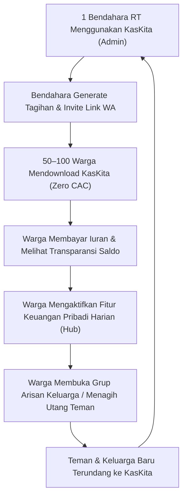

# Analisis Pasar & Peta Kompetisi — KasKita

> [!abstract] Ringkasan Eksekutif
> KasKita beroperasi di persimpangan antara **Aplikasi Pengatur Keuangan Pribadi (Daily Habit)** dan **Platform Manajemen Finansial Sosial/Komunal (Iuran RT, Arisan, Utang Piutang)**. Riset ini membedah kegagalan aplikasi komparator di Indonesia (retensi rendah pada aplikasi RT murni dan kejenuhan catat manual pada aplikasi personal finance murni), serta memetakan keunggulan bersaing KasKita melalui mekanisme *Zero Double-Entry* dan *Product-Led Growth (PLG)*.

---

## 1. Landasan Masalah & Karakter Finansial Masyarakat Indonesia

Masyarakat urban dan sub-urban Indonesia memiliki pola finansial unik yang tidak terakomodasi oleh aplikasi personal finance standar Barat (seperti Mint, YNAB, atau Spendee):

1. **Tingginya Kewajiban Finansial Sosial (Communal Social Spending):**
   - Rata-rata kepala keluarga di Indonesia terlibat dalam minimal 2–4 komunitas finansial: Iuran RT/RW (keamanan & sampah), Iuran Paguyuban/Kompleks, Arisan Keluarga/Kantor, dan Duka Cita/Sosial Warga.
   - Mengabaikan iuran ini menimbulkan sanksi sosial; namun mengelolanya menimbulkan beban administratif yang melelahkan bagi pengurus dan warga.
2. **Kultur "Rasa Sungkan" (Friction of Asking):**
   - Bendahara RT atau panitia arisan sering merasa canggung (*sungkan*) menagih iuran kepada tetangga atau kerabat dekat secara berulang di WhatsApp.
   - Peminjam utang santai antar-teman sering lupa atau menunda pelunasan karena tidak adanya catatan bersama yang objektif dan netral.
3. **Kecurigaan Integritas & Transparansi Rendah:**
   - Pembukuan kas komunal manual di buku tulis atau spreadsheet sering memicu perselisihan, dugaan penggelapan dana kas, atau keterlambatan laporan bulanan warga.
4. **Kejenuhan Catat Manual (Double-Entry Fatigue):**
   - Ketika warga membayar iuran RT Rp50.000 atau arisan Rp200.000, mereka harus mencatatnya secara terpisah di aplikasi keuangan pribadinya jika ingin arus kas pribadinya tetap akurat. 80%+ pengguna menyerah mencatat setelah minggu kedua.

---

## 2. Pemetaan Lanskap Kompetisi di Indonesia (September 2026)

Lanskap aplikasi keuangan dan komunitas di Indonesia saat ini terbagi ke dalam 4 kuadran yang terfragmentasi:

```
                  [Frekuensi Penggunaan Tinggi (Harian / DAU)]
                                        ▲
                                        │
           [KUADRAN 1: PERSONAL FINANCE]│ [KUADRAN 2: KASKITA]
           • Money Lover                │ ★ KASKITA
           • Catatan Keuangan Harian    │   (Daily Multi-Wallet +
           • Spendee / 1Money           │    Auto-Sync Komunitas)
           • Finansialku                │
   Fokus                                │                               Fokus
   Personal ────────────────────────────┼───────────────────────────── Komunal
   Individu                             │                              Sosial
           [KUADRAN 4: ALAT B2B/WARUNG] │ [KUADRAN 3: RT & ARISAN APPS]
           • BukuKas                    │ • RTPINTAR / Erte.co.id
           • BukuWarung                 │ • Kasmini Iuran
           • CrediBook                  │ • Iuran Warga & Arisan
                                        │ • Arisan Keluarga Mandiri (AKM)
                                        ▼
                  [Frekuensi Penggunaan Rendah (Bulanan / MAU)]
```

### Tabel Komparasi Fitur & Kelemahan Kompetitor

| Solusi / Brand | Fokus Utama | Frekuensi Buka | Kelemahan Fatal (*The Pain Point*) |
| :--- | :--- | :---: | :--- |
| **RTPINTAR / Erte.co.id** | Manajemen Lingkungan (IPL, Satpam, Surat Pengantar) | 1–2x / bulan | Birokratis, orientasi top-down RT ke warga, warga hanya buka saat dapat tagihan. Zero personal value. |
| **Kasmini / Iuran Warga** | Buku kas iuran & arisan sederhana | 1–2x / bulan | Desain kuno, tidak terhubung ke dompet harian anggota. Admin lelah input manual, retensi anggota sangat rendah. |
| **Money Lover / Spendee** | Pengatur uang pribadi & budget | Harian (minggu 1) $\rightarrow$ Drop | Tidak ada integrasi dengan kas RT atau arisan. Seluruh transaksi sosial harus diketik manual (risiko *abandonment* tinggi). |
| **BukuKas / BukuWarung** | Pembukuan UMKM & invoice toko | 2–3x / minggu | Terlalu rumit untuk warga/individu karena berorientasi pada laba-rugi toko, inventori barang, dan QRIS merchant. |
| **Google Sheets + Forms + WA** | Pencatatan iuran & laporan publik komunal | Bulanan | Solusi petahana (*incumbent*) paling umum. Warga mudah akses, namun bendahara lelah mencocokkan mutasi bank manual satu per satu, rawan salah rumus, dan zero integrasi kas pribadi. |
| **Splitwise** | Bagi tagihan (*bill splitting*) makan/trip | Sporadis (saat liburan) | Tidak cocok untuk model iuran bulanan berulang RT atau kocokan arisan berputar ala Indonesia. |
| **KasKita** | **Personal Hub + In-App Admin & Guest Web** | **Harian (DAU)** | **Admin kelola 100% di HP; warga bisa bayar via Web Guest tanpa install app, dan terintegrasi otomatis ke dompet pribadi (Zero Double-Entry).** |

---

## 3. Analisis "The Retention Chasm": Mengapa Aplikasi RT Murni Gagal

> [!warning] Jebakan Aplikasi Komunitas Murni (The Monthly Churn Trap)
> Riset membuktikan bahwa aplikasi yang hanya melayani pembayaran iuran RT/arisan memiliki tingkat retensi Day-30 di bawah **8%**. Alasannya jelas: pengguna hanya terdorong membuka aplikasi saat tanggal gajian (tanggal 25–1) untuk membayar iuran, lalu melupakannya selama 28 hari berikutnya. 

Jika KasKita hanya diposisikan sebagai "Aplikasi Kas RT", maka:
1. **Biaya Akuisisi Pengguna (CAC) Sangat Mahal:** Harus mendekati ketua RT atau lurah satu per satu (siklus penjualan B2G/komunitas yang lambat).
2. **LTV Rendah:** Sulit memonetisasi warga jika mereka jarang berinteraksi dengan aplikasi.
3. **Engagement Dingin:** Notifikasi hanya berisi penagihan, menciptakan persepsi negatif bagi warga.

### Solusi Strategis: Arsitektur "Hub & Spoke"
Dengan mengadopsi **Keuangan Pribadi Harian sebagai Poros (Hub)**:
* Pengguna membuka KasKita setiap hari untuk mencatat kopi, bensin, makan siang, dan cek saldo multi-dompet (BCA, Kas Tunai, GoPay).
* Modul sosial (Iuran RT, Arisan, Utang Piutang) bertindak sebagai **Spokes** yang otomatis menyetorkan catatan ke dompet pribadi tanpa perlu input ulang.
* Efeknya: **DAU melonjak drastis, retensi Day-30 naik dari <8% menjadi >35%**.

---

## 4. Mesin Pertumbuhan: Bottom-up Product-Led Growth (PLG)

KasKita memiliki keunggulan akuisisi virality alami yang tidak dimiliki oleh aplikasi personal finance biasa:



### Kalkulasi Koefisien Viralitas ($K$-Factor)
- Rata-rata 1 RT di Indonesia menaungi **40 hingga 80 Kepala Keluarga (KK)**.
- Jika 1 bendahara RT mengadopsi KasKita, terdapat potensi **40–80 pengguna baru** yang diakuisisi secara organik tanpa biaya iklan (*zero paid CAC*).
- Dengan asumsi konversi konservatif:
  - 60% warga aktif mengonfirmasi pembayaran lewat aplikasi = 24–48 pengguna aktif.
  - 15% dari warga tersebut memanfaatkan KasKita untuk membuat ruang baru (misal: Arisan RT, Arisan Kantor, atau Pengeluaran Pribadi) = 3–7 grup baru.
  - Nilai $K$-factor $> 1.2$, menghasilkan pertumbuhan organik eksponensial.

---

## 5. Model Monetisasi & Unit Economics Solopreneur

KasKita dirancang dengan struktur biaya awan hemat daya (*lean cloud architecture*) agar tetap menguntungkan dikelola oleh solopreneur:

### 1. Aliran Pendapatan (Revenue Streams)
1. **Freemium Tier (Gratis):**
   - Catatan keuangan pribadi tanpa batas.
   - Komunitas/Grup gratis hingga 15 anggota (cocok untuk arisan keluarga kecil dan pertemanan).
   - Pengingat jatuh tempo via In-App Push Notification & tautan manual `wa.me`.
2. **Komunitas Pro SaaS (Rp29.000 – Rp79.000 / bulan per workspace):**
   - Untuk RT/RW, cluster perumahan, paguyuban alumni (>15 anggota hingga 200 anggota).
   - Fitur ekspor laporan keuangan profesional format PDF & Excel (standar audit/papan pengumuman).
   - Multi-bendahara dengan audit log aktivitas.
   - Pengingat otomatis via Official WhatsApp API Gateway terintegrasi.
3. **Biaya Transaksi (Fase Mendatang / Pasca-MVP):**
   - Biaya penanganan Rp1.000 – Rp2.000 per transaksi jika integrasi Payment Gateway (QRIS/VA) diaktifkan.

### 2. Struktur Biaya Operasional (Cost Control)
- **Database & Backend:** Supabase Pro / Managed PostgreSQL (~USD 25 / bulan) dapat menampung hingga ratusan ribu transaksi.
- **Media Storage (Bukti Transfer):** Cloudflare R2 (gratis egress bandwidth, biaya penyimpanan ~USD 0.015 / GB). Seluruh gambar bukti bayar dikompresi otomatis ke WebP maks 300 KB.
- **WhatsApp API Protection:** Menggunakan proteksi berjenjang. Tier gratis hanya menggunakan tautan *client-side deep link* (`wa.me/?text=...`) sehingga biaya WhatsApp Gateway KasKita adalah **Rp0**. Pengiriman pesan resmi otomatis hanya diberikan untuk workspace berbayar.

---

## 6. Kesimpulan & Rekomendasi Strategis

1. **Pertahankan Posisi Unik:** Jangan pernah menurunkan derajat KasKita menjadi sekadar "Aplikasi RT" atau "Aplikasi Arisan". Posisi nilai jual utamanya adalah **Aplikasi Keuangan Harian yang Mampu Berinteraksi dengan Komunitas Sekitar**.
2. **Kunci Sukses MVP:** Pastikan alur *Zero Double-Entry* bekerja tanpa cela. Ketika warga membayar iuran RT dan admin menyetujuinya, kepuasan instan (*instant gratification*) terjadi saat notifikasi muncul: *"Iuran RT Rp50.000 berhasil dicatat ke Dompet BCA Anda"*.
3. **Dokumentasi Terintegrasi:** Seluruh dokumen arsitektur (PRD, IA, Skema Database, API) wajib mengacu pada paradigma Hub & Spoke ini.

---
*Lihat dokumen acuan lainnya:*
- [[bisnis/kaskita/README|Dashboard Utama Bisnis KasKita]]
- [[bisnis/kaskita/01-konsep-lean-canvas-prd|Konsep Produk & Scope MVP]]
- [[bisnis/kaskita/03-arsitektur-sistem-dan-database|Arsitektur Sistem & Skema Database]]
- [[bisnis/kaskita/05-strategi-produk-hub-and-spoke|Strategi Produk Hub & Spoke]]
