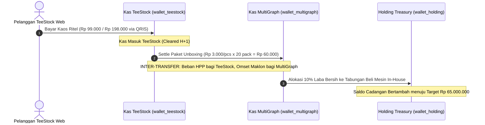

# Sistem Keuangan Multi-Unit & Kas Terisolasi (CFO Executive Suite)

> [!abstract] Visi Finansial Co-Founder (CFO)
> Sesuai arahan Sole Founder (Rizky), BisnisHub OS menerapkan **Financial Discipline Level Tertinggi**: pemisahan saldo kas, mutasi kas, dan cashflow antar-unit bisnis secara terisolasi 100%. Dilarang keras mencampur aduk uang usaha apparel, jasa maklon percetakan, cadangan holding, maupun rekening pribadi founder (*Zero Commingling Rule*).

---

## 1. Arsitektur 4 Dompet Kas Terisolasi (Multi-Wallet Architecture)

| # | Dompet / Kantong Kas | Unit Bisnis Penanggung Jawab | Rekening Finansial | Peruntukan Dana Khusus |
|---|---|---|---|---|
| 1 | `wallet_teestock` | **TeeStock Apparel** (Ritel & POD) | BCA Bisnis (TeeStock) | Belanja bahan kaos polos NSA, ongkos cetak DTF meteran Senen, fee ads Meta/TikTok, kemasan unboxing |
| 2 | `wallet_multigraph` | **MultiGraph Printing** (Maklon B2B) | BCA Maklon (MultiGraph) | Perputaran DP klien kemasan B2B, belanja bahan baku polymailer & stiker grosir, maklon offset |
| 3 | `wallet_holding` | **Holding Reserve Treasury** | Kas Alokasi Laba Ditahan | Tabungan CAPEX beli mesin DTF in-house (Target Rp 65 Jt), buffer dana darurat ekspansi |
| 4 | `wallet_founder` | **Dompet Ekuitas Founder** (Rizky) | Rekening Pribadi Rizky | Rekonsiliasi modal disetor (injeksi) vs penarikan prive resmi founder dari laba bersih |

> [!important] Aturan Penarikan Prive Founder (CFO Guardrail)
> - Prive **hanya boleh diambil** maksimal 30% dari laba bersih kas yang berstatus *Cleared*.
> - **Dilarang keras** mengambil prive dari DP klien maklon yang belum selesai diproduksi atau dari uang kas operasional belanja bahan.

---

## 2. Standar Audit Trail 7-Dimensi (Pencatatan Sejelas-Jelasnya)

Setiap rupiah yang masuk, keluar, atau berpindah wajib memiliki 7 dimensi data terverifikasi:

1. **Nomor Mutasi & Tanggal**: Contoh `TX-ORD-TS-1001` (2026-09-15).
2. **Unit Bisnis**: TeeStock, MultiGraph, Holding Treasury, atau Ekuitas Founder.
3. **Jenis Arus Kas**: `CASH_IN` (Masuk), `CASH_OUT` (Keluar), `INTER_TRANSFER` (Antar-Unit), `CAPITAL_INJECTION` (Modal), `FOUNDER_PRIVE` (Prive).
4. **Akun Sumber & Tujuan**: Contoh `wallet_teestock` &rarr; `wallet_multigraph` atau `BCA Bisnis` &rarr; `Vendor Cititex`.
5. **Kategori Akun (COA)**: Belanja Kaos Polos NSA, Cetak DTF, Kemasan Unboxing, DP Cetak Kemasan B2B, Injeksi Modal.
6. **Bukti Nota / Ref Mutasi**: Kwitansi fisik, invoice toko Shopee/Cititex, nomor mutasi bank (contoh `NOTA-CITITEX-4412`).
7. **Status Settlement**: `Cleared` (Sudah efektif di rekening) vs `Pending` (Menunggu kliring gateway H+1).

---

## 3. Alur Sinergi Inter-Unit Settlement (TeeStock &harr; MultiGraph)

Dalam ekosistem MultiGraph Holding, kemasan ritel TeeStock disuplai langsung oleh MultiGraph:

### Keuntungan Sinergi Internal:
- **Penghematan TeeStock**: Harga beli unboxing pack internal Rp 3.000 vs harga retail pihak ketiga Rp 5.500 (hemat **Rp 2.500/order**).
- **Kepastian Pasar MultiGraph**: MultiGraph memiliki captive market reguler setiap TeeStock meluncurkan drop apparel.

---

## 4. Laporan Laba Rugi Unit (Unit P&L Statement) & CFO Rule

### Formula HPP Wajib TeeStock:
$$\text{HPP Total} = \text{Kaos Polos NSA (Rp 38.000)} + \text{Cetak DTF (Rp 10.000)} + \text{Kemasan MultiGraph (Rp 3.000)} + \text{Defect Buffer 5\% (Rp 2.550)} = \text{Rp 53.550}$$

### Batas Bawah Margin CFO:
- **Gross Margin Minimum**: 50%
- **Net Margin Minimum**: 35% (Harga ritel Rp 99.000 menghasilkan laba bersih ~Rp 44.000 / helai).
- Dilarang membuat diskon/promo yang menekan net margin di bawah 25% tanpa persetujuan CFO.

---

## 5. CFO AI Diagnostics & Runway Engine

BisnisHub OS secara otomatis memantau kesehatan kas melalui:
1. **Daily Burn Rate**: Rata-rata pengeluaran operasional per hari (30 hari terakhir).
2. **Cash Runway**: Proyeksi daya tahan hidup kas holding tanpa pendapatan baru sama sekali (Target: &ge; 6 bulan).
3. **CFO Health Score**: Indeks kepatuhan finansial (1-100) berdasarkan ketiadaan utang berbunga, likuiditas positif, dan kedisiplinan pemisahan rekening.

---

## 6. Mesin Valuasi Bisnis Holding & Trajektori Pertumbuhan (Valuation Engine)

BisnisHub OS mengukur nilai ekosistem bisnis Rizky menggunakan **3 Metode Valuasi Korporasi Riil**:

$$\text{Fair Enterprise Valuation} = (0.40 \times \text{NAV}) + (0.40 \times \text{SDE Multiple}) + (0.20 \times \text{Revenue Multiple})$$

### Rincian 3 Metode Valuasi:
1. **Net Asset Value (NAV / Floor Value)**:
   - Nilai harta fisik nyata jika bisnis dilikuidasi hari ini: `Kas di Bank + Stok Kaos Polos NSA + DTF Film + Kemasan + Mesin CAPEX - Utang (Rp 0)`.
2. **SDE Multiple (Seller's Discretionary Earnings)**:
   - Valuasi berbasis daya menghasilkan laba bersih kas ditambah prive pemilik: `(Annualized Net Profit + Prive) x 2.8x Multiple`.
3. **Revenue Multiple (GMV Disetahunkan)**:
   - Valuasi berbasis skala omset tahunan: `Annualized Revenue x 1.5x Multiple`.

### Roadmap Trajektori Valuasi MultiGraph Holding:
| Milestone | Target Valuasi | Capaian Operasional Kunci | Status Holding |
|---|---|---|---|
| **Level 1: Bootstrap Foundation** | **Rp 25.000.000** | Drop #01 TeeStock tervalidasi, kas operasional positif, nol utang bank. | 🟢 **Tercapai** |
| **Level 2: In-House DTF Machine** | **Rp 120.000.000** | Mesin DTF 58cm in-house terbeli di Holding Treasury (Rp 65 Jt), HPP DTF turun 40%. | 🟡 **Sedang Berjalan** |
| **Level 3: Full Multi-Unit Synergy** | **Rp 500.000.000** | Aktivasi penuh Neo Pack (Kemasan B2B) & Squeegee Studios (Sablon Manual). | 🔵 **Roadmap Fase 3** |

### Metrik Kecepatan Modal (Cash Conversion Cycle):
- **Siklus Kas Sempurna 48 Jam**: Hari ke-0 (Beli bahan) &rarr; Hari ke-1 (Press & Kirim) &rarr; Hari ke-2 (Uang pelanggan cair di rekening BCA Bisnis via QRIS H+1).

---

> [!tip] Akses di BisnisHub OS
> - Buka **Dashboard Utama** di `bisnishub.rizkywahyudin.com/` untuk melihat ringkasan Valuasi Ekuitas & NAV.
> - Buka menu **Buku Kas & Modal** di `bisnishub.rizkywahyudin.com/buku-kas` (Sub-Tab 5) untuk simulator skenario multiple dan rincian lengkap.

