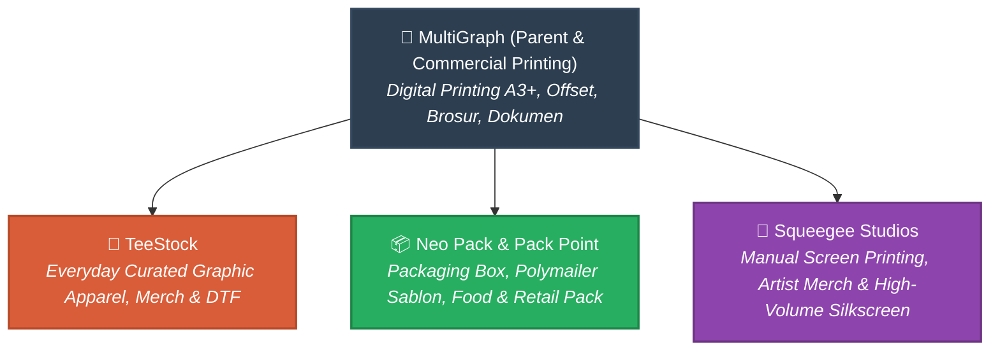
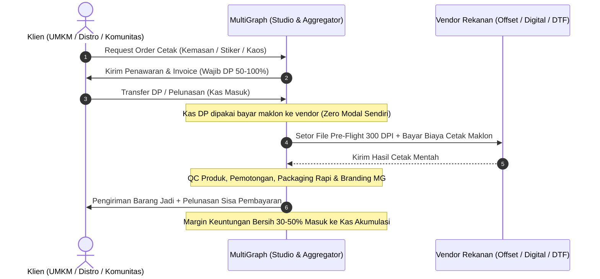

# 🌐 Arsitektur Ekosistem & Visi Induk Bisnis MultiGraph

> [!abstract] Ringkasan Eksekutif
> Dokumen ini mencatat visi jangka panjang dan integrasi vertikal **MultiGraph** sebagai induk ekosistem percetakan terpadu, memetakan 4 lini spesialisasi bisnis, mendokumentasikan analisis kritis permodalan (termasuk tinjauan ide koin kripto MGX), serta menyusun peta jalan transisi dari model *capital-heavy* menuju strategi *asset-light bootstrap* (customer-funded).

---

## 1. Peta Ekosistem & Unit Bisnis Turunan

MultiGraph diangankan sebagai entitas induk (*holding/parent company*) yang menaungi seluruh rantai pasok industri cetak, kemasan, dan garmen:

### Rincian Spesialisasi Unit:
1. **MultiGraph (Induk & Percetakan Komersial):**
   - **Fokus:** Digital printing lembaran (A3+), percetakan offset skala besar, perlengkapan promosi kantor (kartu nama, brosur, kalender, poster, flyer).
2. **[[bisnis/teestock/README|TeeStock]] (Garmen & Tekstil Apparel):**
   - **Fokus:** Ritel fashion kasual, kaos grafis terkurasi, totebag, hoodie, dan apparel merch berbasis Direct-to-Film (DTF) dan heat press in-house.
3. **Neo Pack / Pack Point (Spesialis Kemasan & Packaging):**
   - **Fokus:** Kotak kardus/corrugated box custom, standing pouch, kantong polymailer doff bersablon, paper bag retail, stiker segel unboxing, dan kemasan F&B.
4. **Squeegee Studios (Studio Sablon Manual & Seni Cetak Saring):**
   - **Fokus:** Sablon manual plastisol, discharge, waterbased untuk pesanan garmen partai besar (lusinan/ratusan) yang menuntut efisiensi biaya dibanding DTF serta merchandise musisi/seniman grafis.

---

## 2. Bedah Kelayakan Pendanaan: Analisis Ide Koin Kripto (MGX)

> [!info] Latar Belakang Ide Founder
> Muncul ide untuk menerbitkan dan me-listing koin kripto bernama **MGX** sebagai instrumen penggalangan dana publik (*crowdfunding*) sekaligus mata uang sirkulasi internal di dalam ekosistem MultiGraph guna mengatasi kendala ketiadaan modal mesin cetak.

### Evaluasi Tim C-Level (CFO & CTO Review)

| Aspek | Realitas & Tantangan Lapangan | Status Rekomendasi |
|---|---|---|
| **Regulasi & Legalitas** | Di Indonesia, penggalangan dana publik melalui token utilitas/kripto tunduk pada aturan ketat Bappebti & OJK. Pelanggaran skema investasi fisik tanpa perizinan resmi berisiko jerat hukum. | ❌ **High Risk** |
| **Kebutuhan Likuiditas (Cash)** | Listing token di DEX/CEX membutuhkan dana ratusan juta rupiah untuk penyediaan *Liquidity Pool* (LP) dan biaya sewa *market maker*, yang nilainya sering kali lebih mahal dari harga mesin cetak fisik. | ❌ **Capital Inefficient** |
| **Profil Pasar & Adopsi** | Klien percetakan UMKM lokal dan distro butuh kemudahan pembayaran (Rupiah/QRIS/Transfer Bank), bukan friksi dompet Web3 (*crypto wallet*, gas fee). | ❌ **High Friction** |
| **Beban Operasional & Fokus** | Mengelola *smart contract*, mitigasi eksploitasi keamanan, dan merawat komunitas investor Web3 akan menyedot 100% energi solopreneur, mematikan operasional bisnis riil. | ❌ **Massive Distraction** |

> [!important] Keputusan Strategis CFO & Mentor Bisnis
> **Ide Koin MGX Diberhentikan / Diarsipkan (*Shelved Indefinitely*)**. 
> Model permodalan dialihkan sepenuhnya ke **Customer-Funded Growth** (pembiayaan berbasis uang muka pelanggan) yang jauh lebih aman, legal, dan membumi.

---

## 3. Strategi Eksekusi: Model "Asset-Light" (Zero Capex)

Masalah ketiadaan modal mesin **bukanlah jalan buntu**. Industri percetakan memiliki ribuan mesin yang berstatus *idle capacity* (kapasitas menganggur) di berbagai sentra cetak.

MultiGraph akan dihidupkan sebagai **Smart Print Aggregator & Studio Kreatif**:

### Keunggulan Model Ini bagi Solopreneur:
1. **Nol Pengeluaran Mesin (No Capex):** Tidak ada cicilan mesin ratusan juta, tidak ada biaya sewa ruko industri, tidak ada risiko depresiasi mesin atau biaya teknisi perbaikan.
2. **Kekuatan pada File Pre-Flight & QC:** Vendor cetak konvensional sering kali tidak mau pusing memeriksa file desain konsumen yang resolusinya pecah. MultiGraph menjual nilai tambah: **standarisasi file cetak 300 DPI, tata letak gang sheet hemat bahan, dan kontrol mutu (QC)**.

---

## 4. Rencana Transisi Bertahap (Organic Flywheel)

Holding MultiGraph dibangun secara evolutif mengikuti prinsip alokasi energi solopreneur:

### Fase 1: Fokus Arus Kas Cepat — [[bisnis/teestock/README|TeeStock]] (Saat Ini)
- Prioritas utama: Dapatkan penjualan ritel apparel perdana melalui web app dan TikTok/Instagram.
- Menggunakan mesin heat press in-house dan vendor cetak DTF meteran.

### Fase 2: Efisiensi Internal & Portofolio — MultiGraph Supporting Arm
- MultiGraph memproduksi seluruh paket *unboxing experience* TeeStock:
  - Hangtag tebal (Art Carton 310 gsm)
  - Stiker vinyl unboxing collector
  - Polymailer sablon logo
  - Care card & voucher insert
- Seluruh rincian HPP dan harga pasok internal tercatat di [[bisnis/multigraph/operasional/katalog-kemasan-teestock|Katalog Kemasan TeeStock]].
- Hasil kemasan TeeStock didokumentasikan sebagai portofolio awal MultiGraph.

### Fase 3: Ekspansi B2B Eksternal — Kemasan UMKM (Neo Pack)
- Mulai membuka pesanan cetak stiker label botol, hangtag pakaian, dan kemasan kardus untuk brand lokal dan UMKM sekitar via sistem maklon.
- Syarat mutlak: DP 50–100% di muka.

### Fase 4: Studio Produksi Sendiri — Squeegee Studios & Mesin In-House
- Setelah volume pesanan stabil dan laba bersih kas mencukupi:
  - Pembelian mesin cutting plotter stiker sendiri.
  - Pembelian printer roll DTF sendiri.
  - Pembangunan meja sablon manual (Squeegee Studios) untuk order garmen partai besar.

---

## 5. Tautan & Dokumen Terkait

- [[bisnis/multigraph/README|Halaman Utama MultiGraph]]
- [[bisnis/multigraph/operasional/katalog-kemasan-teestock|Katalog Pasokan Kemasan Perdana TeeStock]]
- [[bisnis/teestock/README|Dokumentasi Induk TeeStock]]
