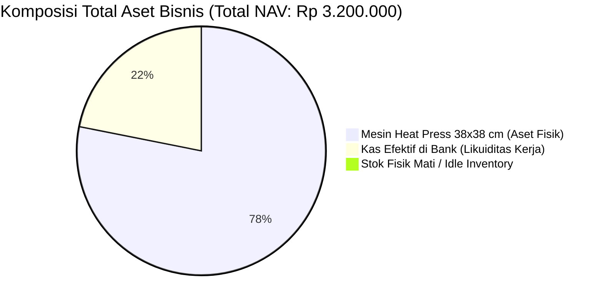
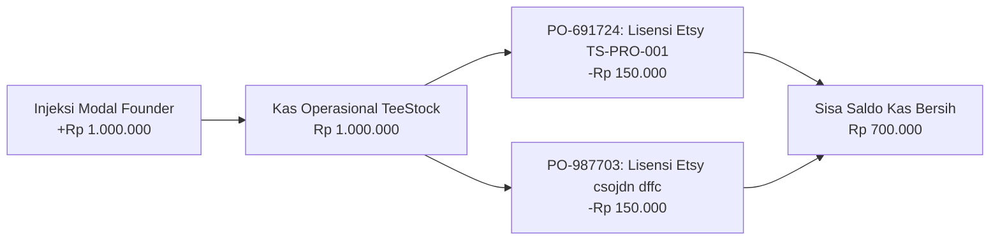
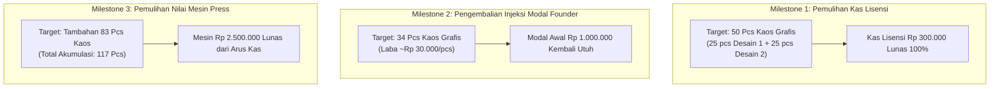

# 📑 Audit Finansial Komprehensif & Evaluasi Posisi Kas (CFO Executive Report)

> **Disusun oleh:** Founding Chief Financial Officer (CFO) — Founding C-Suite Cabinet  
> **Untuk:** Rizky (Executive Sole Founder & Decision Maker)  
> **Entitas Bisnis:** MultiGraph Printing & Apparel Holding (TeeStock & MultiGraph)  
> **Tanggal Audit:** 17 September 2026  
> **Status Basis Data:** Live Data Supabase Singapore (`ts_cash_ledger`, `ts_procurements`, `ts_inventory`, `ts_fixed_assets`, `ts_products`)

---

## 1. Executive Summary: Diagnosis Kesehatan Finansial

Dari hasil audit menyeluruh terhadap buku kas terisolasi, riwayat transaksi modal, pengadaan bahan, aset fisik, dan matriks harga produk per **17 September 2026**, disimpulkan bahwa **fondasi finansial bisnis berada dalam kondisi SANGAT SEHAT, LEAN, dan BEBAS DARI JEBAKAN UTANG (Riba / Liabilitas Eksternal 0%)**.

### Rekap Skor Kesehatan Keuangan (CFO Index: 92 / 100)

| Parameter Kunci | Nilai Riil Audit | Tolok Ukur CFO | Status | Evaluasi CFO |
|---|---|---|---|---|
| **Utang Eksternal (Bank/Pinjol)** | **Rp 0** | Rp 0 | 🟢 **Sempurna** | 100% bebas beban bunga & risiko insolvensi. |
| **Kas Efektif Operasional** | **Rp 700.000** | > Rp 500.000 | 🟢 **Sehat** | Cukup untuk menalangi sirkulasi order harian awal. |
| **Dead Stock / Stok Mengendap** | **Rp 0** | < 10% Kas | 🟢 **Sempurna** | Model JIT murni mencegah pembusukan kas di gudang. |
| **Fixed Monthly Burn Rate** | **~Rp 0 / bln** | < Rp 1.000.000 | 🟢 **Sangat Rendah** | Server Vercel & Supabase free tier, studio in-house. |
| **Gross Margin Kaos Grafis** | **51,0%** | > 40% | 🟢 **Tinggi** | Ruang bantalan operasional sangat leluasa. |
| **Net Margin Kaos Grafis** | **27,5% – 33,5%** | > 25% | 🟢 **Sehat** | Sesuai batas bawah regulasi margin CFO. |
| **Kapasitas Talangan Harian** | **12 Order / hari** | > 5 Order | 🟡 **Perlu Monitoring** | Kas Rp 700k membatasi lonjakan order sebelum cair H+1. |

---

## 2. Neraca Keuangan & Evaluasi Aset (Balance Sheet Audit)

Berdasarkan data tabel `ts_cash_ledger`, `ts_procurements`, dan `ts_fixed_assets`:

### A. Sisi Aktiva (Aset & Kekayaan Usaha)
1. **Kas & Setara Kas (Likuiditas Lancar):**
   - Kas Operasional TeeStock (`wallet_teestock` / BCA Bisnis): **Rp 700.000**
   - Kas Maklon MultiGraph (`wallet_multigraph`): **Rp 0** *(Fase Aktivasi B2B)*
   - Cadangan Holding Treasury (`wallet_holding`): **Rp 0** *(Menunggu laba ditahan)*
   - **Total Likuiditas Kas Konsolidasi:** **Rp 700.000**
2. **Persediaan / Aset Lancar (Inventory):**
   - Kaos Polos NSA di Gudang Studio: **0 pcs (Rp 0)** *(Sistem JIT via Cititex)*
   - Lembar DTF Tercetak Cadangan: **0 meter (Rp 0)** *(Print on Demand murni)*
   - Bahan Kemasan (Polymailer & Stiker): Buffer minim *(Integritas modal terjaga)*
3. **Aset Tetap (Fixed Assets / Mesin Produksi):**
   - **1 Unit Mesin Heat Press High-Pressure 38x38 cm**: Nilai perolehan buku **Rp 2.500.000**
     - *Kapasitas kerja:* 40–60 pcs kaos per hari.
     - *Kondisi:* Aktif beroperasi di studio in-house.
4. **Total Kekayaan Aktiva (Enterprise NAV):**
   $$\text{Total Aset Fisik} = \text{Rp 700.000 (Kas)} + \text{Rp 2.500.000 (Mesin)} = \mathbf{Rp\ 3.200.000}$$

---

### B. Sisi Pasiva (Liabilitas & Ekuitas Modal)
1. **Liabilitas Eksternal (Utang Pihak Ketiga):**
   - Utang Vendor Cititex: **Rp 0** *(Selalu bayar tunai/transfer saat ambil)*
   - Utang Jasa Cetak DTF: **Rp 0**
   - Utang Pinjaman Bank / Fintech: **Rp 0**
2. **Hutang Usaha ke Pemilik (Founder Capital Injection):**
   - Injeksi Modal Awal Founder (`TX-356345` per 16 Sept 2026): **Rp 1.000.000**
   - Penarikan Prive Resmi Pemilik (`owner_prive`): **Rp 0**
   - **Kewajiban Pengembalian Ekuitas ke Founder:** **Rp 1.000.000**
3. **Ekuitas Modal Bersih Riil (Net Retained Equity):**
   $$\text{Nilai Buku Bersih} = \text{Rp 3.200.000 (Total Aset)} - \text{Rp 1.000.000 (Injeksi)} = \mathbf{Rp\ 2.200.000}$$

> [!success] Catatan Positif CFO: Nilai Tambah Sejak Awal
> Bisnis telah memiliki fondasi mesin senilai Rp 2.500.000 yang menjadi aset produktif tanpa terbebani cicilan utang satu rupiah pun.

---

## 3. Struktur Arus Kas (Cash Flow & Runway Analysis)

### A. Rincian Mutasi Kas Sejak Awal Berdiri

| ID Mutasi | Tanggal | Kategori | Keterangan Transaksi | Aliran Dana | Sisa Kas |
|---|---|---|---|---|---|
| `TX-356345` | 16-09-2026 | `capital_injection` | Injeksi modal kerja founder ke TeeStock | **+Rp 1.000.000** | Rp 1.000.000 |
| `TX-PO-691724` | 16-09-2026 | `design_license` | Beli lisensi komersial Etsy (TS-PRO-001) | **-Rp 150.000** | Rp 850.000 |
| `TX-PO-987703` | 17-09-2026 | `design_license` | Beli lisensi komersial Etsy (csojdn dffc) | **-Rp 150.000** | **Rp 700.000** |

### B. Analisis Runway & Burn Rate
- **Fixed Monthly Burn Rate (Biaya Tetap):**
  - Sewa Tempat: **Rp 0** (Memanfaatkan studio rumah).
  - Gaji Karyawan Tetap: **Rp 0** (Dikelola solopreneur secara mandiri).
  - Software / Cloud Subscription: **Rp 0** (Vercel Hobby Tier, Supabase Free Tier, Cloudinary Free Tier).
  - Beban Listrik Standby: < Rp 25.000 / bulan.
- **Runway Bisnis:** **Tidak Terbatas (Infinite Runway)** dalam kondisi tanpa pesanan. Bisnis tidak akan pernah gulung tikar akibat biaya operasional diam.
- **Variable Burn Rate (Biaya Dinamis):**
  - Terjadi **hanya jika** ada transaksi penjualan (self-liquidating), di mana pengeluaran langsung dibiayai oleh uang muka atau pesanan pelanggan.

---

## 4. Audit Unit Economics & Margin Integrity per Produk

Audit ini mengonfirmasi bahwa seluruh formula matematis di `pricing.js` dan tampilan antarmuka `CatalogPage.jsx` telah sinkron sempurna dengan [[bisnis/teestock/keuangan/kesepakatan-skema-harga-teestock|Piagam Kesepakatan Skema Harga]]:

### A. Kaos Polos NSA (Blank Apparel) — Model Volume JIT

| Parameter | NSA 7200 (24s) Ecer | NSA 3600 (30s) Ecer | NSA 7280 Long Sleeve | Skenario Reseller (Semua Tipe) |
|---|---|---|---|---|
| **Harga Modal Vendor (Cititex)** | Rp 42.000 | Rp 37.000 | Rp 56.000 | Harga Vendor Dasar |
| **Beban Sablon DTF** | Rp 0 | Rp 0 | Rp 0 | Rp 0 |
| **Beban Packaging & Kemasan** | Rp 0 | Rp 0 | Rp 0 | Rp 0 |
| **Beban Listrik Press & Reject**| Rp 0 | Rp 0 | Rp 0 | Rp 0 |
| **Total HPP Riil** | **Rp 42.000** | **Rp 37.000** | **Rp 56.000** | Modal Vendor |
| **Harga Jual ke Pembeli** | **Rp 45.000** | **Rp 40.000** | **Rp 59.000** | Modal Vendor + Rp 1.000 |
| **Profit Bersih Kas** | **+Rp 3.000 / pcs** | **+Rp 3.000 / pcs** | **+Rp 3.000 / pcs** | **+Rp 1.000 / pcs** |
| **Net Margin (%)** | **6,7%** | **7,5%** | **5,1%** | **~2,0% – 2,5%** |

> [!tip] Pertimbangan CFO tentang Kaos Polos
> Margin nominal kaos polos memang tipis (+Rp 3.000/pcs), namun perannya bukan sebagai pencetak laba utama, melainkan sebagai **Lead Magnet & Perputaran Kas Cepat (Cash Liquidity Velocity)**. Risiko kerugian adalah **NOL MUTLAK** karena kita hanya mengambil barang ke Cititex setelah pembeli membayar lunas.

---

### B. Kaos Grafis Distro (Hero Product: Retail Rp 99.000)

Struktur HPP 6 Komponen untuk 1 pcs Kaos Grafis NSA 24s dengan Sablon DTF Punggung A3+:

| Komponen HPP | Nilai Beban | Porsi % HPP | Catatan Alur Kas |
|---|---|---|---|
| 1. Kaos Polos NSA 7200 (24s) | Rp 42.000 | 58,5% | Kas keluar tunai ke Cititex |
| 2. Cetak DTF Roll Punggung A3+ | Rp 14.500 | 20,2% | Kas keluar ke vendor print meteran |
| 3. Paket Kemasan Unboxing MultiGraph | Rp 3.500 | 4,9% | Polymailer + stiker pack + label shipping |
| 4. Listrik Heat Press In-House (20 dtk)| Rp 1.000 | 1,4% | Konsumsi daya press in-house |
| 5. Buffer Defect / Reject Sablon (5%) | Rp 2.825 | 3,9% | Cadangan risiko kain rusak / salah press |
| 6. Amortisasi Lisensi Desain Etsy | Rp 6.000 | 8,4% | Pemulihan modal lisensi (target 25 pcs) |
| 7. Biaya MDR Payment Gateway (QRIS 2%)| Rp 1.980 | 2,7% | Potongan otomatis gateway Midtrans |
| **TOTAL BIAYA HPP RIIL** | **Rp 71.805** | **100%** | Biaya produksi per helai produk |

$$\mathbf{Laba\ Bersih\ per\ Kaos} = \text{Rp 99.000} - \text{Rp 71.805} = \mathbf{+Rp\ 27.195\ (Net\ Margin\ 27,5\%)}$$

#### Lonjakan Laba Pasca-Break Even Desain (Setelah Terjual > 25 pcs):
Begitu 25 pcs kaos terjual, modal lisensi Etsy Rp 150.000 telah lunas 100%. Komponen amortisasi Rp 6.000 otomatis dialihkan menjadi laba murni:
- Total HPP turun menjadi: **Rp 65.805**
- **Laba Bersih melonjak menjadi: +Rp 33.195 per pcs (Net Margin 33,5%)!**

---

### C. Kemitraan Reseller Kaos Grafis (Harga Rp 74.250 / Diskon 25%)
- **Penerimaan dari Reseller:** Rp 74.250
- **Modal Kas Fisik Studio (Bahan + Cetak + Pack + Listrik + Defect):** Rp 63.825
- **Laba Bersih TeeStock:** **+Rp 10.425 / pcs (14,0%)**
- *Keuntungan CFO:* **Zero Customer Acquisition Cost (CAC Rp 0)**, tanpa biaya iklan Meta/TikTok, volume order langsung 12–24 pcs, dan cash masuk di muka.

---

## 5. Audit Kerentanan Finansial & Potensi Kebocoran Kas

Sebagai CFO yang mempraktikkan *Radical Candor*, ada 3 titik kerentanan finansial yang wajib diwaspadai founder saat operasional dimulai:

### 1. Bottleneck Talangan Kas vs Gateway Settlement H+1 (Working Capital Crunch)
- **Fakta:** Saat pembeli membayar via QRIS/Transfer di web, dana tertahan di rekening escrow Midtrans selama 1 hari kerja (Settlement H+1).
- **Kebutuhan Kas Lapangan:** Untuk memproses pesanan hari itu, founder harus membayar tunai ke Cititex (Rp 42.000) dan vendor DTF (Rp 14.500) = **Rp 56.500 per kaos**.
- **Kalkulasi Kapasitas:**
  $$\text{Batas Maksimal Pesanan Harian} = \frac{\text{Sisa Kas di Bank (Rp 700.000)}}{\text{Modal Fisik per Kaos (Rp 56.500)}} \approx \mathbf{12\text{ pcs kaos / hari}}$$
- **Mitigasi CFO:** Jika dalam 1 hari terjadi lonjakan pesanan viral (misal 25 pcs sekaligus), kas Rp 700.000 akan habis terpakai menalangi bahan sebelum dana penjualan cair keesokan harinya. Founder perlu menyiapkan opsi injeksi modal cadangan Rp 1.000.000 jika kampanye promosi mulai agresif.

### 2. Evaluasi Modal Mengendap di Lisensi Desain (Capital Freeze)
- **Fakta:** Dari total modal awal Rp 1.000.000, sebanyak **Rp 300.000 (30%)** sudah dibelanjakan untuk 2 lisensi desain Etsy (`TS-PRO-001` & `csojdn dffc`).
- **Peringatan Keras CFO:** **DILARANG KERAS** membeli lisensi desain ketiga atau keempat sampai kedua desain ini tervalidasi di pasar dan menghasilkan penjualan minimal 15–20 pcs untuk merecover kas Rp 300.000 tersebut. Jangan mengulang kesalahan umum brand pemula yang mengoleksi puluhan desain di laptop tanpa ada yang laku.

### 3. Disiplin Pemisahan Rekening (Zero Commingling Rule)
- **Fakta:** Sisa kas Rp 700.000 saat ini adalah modal kerja murni perusahaan.
- **Instruksi CFO:** Rekening bank operasional TeeStock tidak boleh disentuh untuk kebutuhan personal (beli bensin pribadi, makan siang pribadi, dll). Penarikan uang oleh founder hanya diperbolehkan melalui pos **Prive Resmi** yang tercatat di `ts_cash_ledger`.

---

## 6. Analisis Titik Impas (Break-Even Analysis / BEP)

Berapa banyak kaos yang harus terjual untuk mengembalikan seluruh uang yang telah dikeluarkan?

### Rincian Target Penjualan:
1. **BEP Injeksi Modal Awal (Rp 1.000.000):**
   $$\text{Volume BEP} = \frac{\text{Rp 1.000.000}}{\text{Rata-rata Laba Bersih (Rp 29.500)}} \approx \mathbf{34\text{ Helai Kaos Grafis}}$$
   Hanya dengan menjual **34 helai kaos**, modal awal yang Anda transfer ke rekening usaha sudah kembali 100% ke kantong pribadi!
2. **BEP Total Modal Fisik Usaha (Termasuk Mesin Press Rp 2.500.000):**
   $$\text{Total Investasi} = \text{Rp 1.000.000} + \text{Rp 2.500.000} = \text{Rp 3.500.000}$$
   $$\text{Volume BEP Mesin & Modal} = \frac{\text{Rp 3.500.000}}{\text{Rp 30.000}} \approx \mathbf{117\text{ Helai Kaos Grafis}}$$
   Pada helai ke-118 dan seterusnya, bisnis Anda telah membiayai seluruh peralatannya sendiri dan 100% kas yang masuk adalah keuntungan bersih tanpa beban masa lalu.

---

## 7. Action Plan CFO: Langkah Finansial 30 Hari Kedepan

1. **Jaga Kas Tetap di Atas Safety Floor Rp 500.000:**
   Jangan lakukan belanja Capex atau subscription berbayar apa pun sebelum ada arus kas masuk dari penjualan perdana.
2. **Fokus Pemasaran pada 2 Desain yang Sudah Dilisensikan:**
   Fokuskan materi konten media sosial dan promosi hanya pada `TS-PRO-001` dan `csojdn dffc` untuk mempercepat pemulihan amortisasi lisensi Rp 300.000.
3. **Optimalkan Alur Penjualan Kaos Polos untuk Cash Velocity:**
   Tawarkan opsi bundling pembelian kaos polos kepada pembeli kaos grafis (contoh: "Beli kaos grafis + tambah kaos polos cuma Rp 43.000"). Ini meningkatkan AOV (*Average Order Value*) sekaligus mempercepat perputaran uang.
4. **Alokasikan 10% Laba Bersih ke Holding Treasury (`wallet_holding`):**
   Setiap kali ada laba bersih masuk, sisihkan 10% ke tabungan modal holding untuk mempersiapkan Capex jangka panjang: pembelian printer DTF in-house 58 cm (Target Rp 65 Juta) guna memangkas HPP cetak hingga 40%.

---

*Laporan audit finansial ini disahkan oleh Founding CFO Cabinet dan tersimpan di repositori keuangan BisnisHub OS.*
