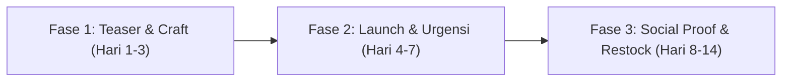

# 🚀 Playbook Peluncuran Fase Awal (Drop #01) TeeStock

> [!abstract] Visi & Target Fase Awal (Sprint 14 Hari)
> **Target Utama**: Mencapai **30 – 50 pesanan nyata pertama** tanpa bakar uang (*zero cash burn*), memvalidasi alur produksi in-house, dan mengumpulkan 20+ bukti sosial (video/foto unboxing UGC) untuk fondasi repeat order.
> 
> - **Target Omset**: Rp 3.500.000 – Rp 5.000.000
> - **Target Laba Bersih**: Rp 1.200.000 – Rp 1.800.000 (Margin Konsolidasi ~35–40%)
> - **Target Kas**: Nol utang, arus kas positif, modal perputaran kembali dalam 48 jam.

---

## 1. Arsitektur Penawaran (*Pricing & Offer Stack*)

Untuk menghindari jebakan diskon murahan yang merusak persepsi brand, kita menggunakan strategi **Tiered Launching Offer** dengan kuota terbatas:

| Tier Penawaran | Harga Jual | HPP Riil | Laba Bersih | Net Margin | Kuota & Syarat |
|---|---|---|---|---|---|
| **Tier 1: Early Founder Drop** | **Rp 79.000** | Rp 53.550 | Rp 25.450 | **32.2%** | **Maksimal 30 pcs pertama**. Wajib tag story unboxing. |
| **Tier 2: Double Drop Pack (2 Kaos)** | **Rp 169.000** | Rp 101.100* | Rp 67.900 | **40.2%** | 2 Kaos desain bebas + Free Sticker Pack MultiGraph. |
| **Tier 3: Regular Drop #01** | **Rp 99.000** | Rp 53.550 | Rp 45.450 | **44.4%** | Harga standar setelah kuota 30 pcs habis. |

> [!note] *Catatan HPP Paket 2 Kaos
> Karena 2 kaos dikemas dalam 1 polymailer dan 1 kartu terima kasih, biaya kemasan dan packaging collaterals hanya keluar satu kali, menaikkan margin bersih ke **40.2%**!

---

## 2. Alur Produksi & Inventori Minimum (*Lean Operations*)

> [!important] Prinsip Anti-Overstock (Jangan Timbun Modal)
> Di fase awal, jangan cetak ratusan kaos sebelum ada pesanan. Gunakan sistem **Buffer Hybrid**:

1. **Buffer Bahan Kaos Polos Studio**:
   - 12 pcs NSA Heavyweight 24s Hitam (4 L, 6 XL, 2 XXL - ukuran paling dicari di distro).
   - 6 pcs NSA Heavyweight 24s Putih (2 M, 2 L, 2 XL).
   - *Total modal kaos buffer: ~Rp 684.000*.
2. **Buffer Film DTF Siap Press**:
   - Cetak gang sheet DTF roll 58 cm x 3 meter di vendor cetak DTF rekanan (~Rp 105.000).
   - Berisi artwork Drop #01 (Origins Series), logo dada, dan care label leher.
3. **Buffer Kemasan Unboxing (Sinergi MultiGraph)**:
   - 30 pcs Polymailer Hitam Doff 30x40 cm.
   - 30 pcs Hangtag 310 gsm doff + Tali loop.
   - 30 pcs Paket Stiker Vinyl Die-Cut (3 desain stiker per pack).
   - *HPP internal MultiGraph: Rp 3.000 per paket unboxing*.

---

## 3. Strategi Konten Organik 14 Hari (Social Traffic Engine)

Fokus kanal: **TikTok & Instagram Reels (Format Vertikal 9:16)**. Tidak perlu pasang iklan berbayar dulu di minggu pertama. Gunakan formula konten 4E:



### 🎬 Fase 1: Teaser & Craftsmanship (Hari 1 – 3)
- **Konten 1 (Curiosity Hook)**: *"Kenapa gue nekat bikin brand kaos sendiri padahal distro lokal udah bejibun?"*
  - Ceritakan keresahan founder: sablonan tipis gampang pecah vs TeeStock yang pakai NSA Heavyweight 24s gramasi tebal dan DTF high-density.
- **Konten 2 (Visual ASMR)**: Video detail suara peel-off film DTF yang dingin (*cold peel*) di atas kain katun tebal, dilanjutkan finishing press teflon.
- **Konten 3 (Unboxing Reveal)**: Tunjukkan unboxing experience: polymailer doff, aroma kaos baru, kartu terima kasih bertanda tangan founder, dan bonus 3 stiker anti-air.

### 🔥 Fase 2: Launching Day & Urgensi (Hari 4 – 7)
- **Konten 4 (The Announcement)**: *"Drop #01 Resmi Dibuka! Khusus 30 orang pertama yang checkout di website teestockapparel.vercel.app dapet harga perdana Rp 79.000."*
- **Konten 5 (Live Countdown / Story Updates)**: Update kuota berkala di Story: *"Tersisa 18 slot dari 30 kuota perdana."* (Menciptakan efek kelangkaan riil).
- **Konten 6 (Order Packing)**: Video proses packing pesanan pertama yang masuk: tempel label thermal A6, masukkan bonus stiker, seal polymailer.

### 🌟 Fase 3: Bukti Sosial & Testimoni (Hari 8 – 14)
- **Konten 7 (Customer Reaction)**: Repost story atau chat WhatsApp pelanggan saat kaos sampai di rumah.
- **Konten 8 (Fit & Styling Guide)**: Cara styling kaos Drop #01 dengan celana cargo / denim untuk nongkrong akhir pekan.
- **Konten 9 (Sold Out Notice)**: Pengumuman kuota Rp 79.000 habis, harga kembali ke normal Rp 99.000 untuk batch berikutnya.

---

## 4. SOP Penanganan Pelanggan & WhatsApp Closing

Gunakan alur chat cepat via WhatsApp Web atau BisnisHub:

```
[Template Chat 1: Konfirmasi Pesanan & Pembayaran QRIS]
Halo Kak {Nama_Pelanggan}! 👋
Terima kasih banyak sudah order di Drop Perdana TeeStock! 

Rincian Pesanan: {Kode_Pesanan}
Item: {Nama_Produk} ({Warna} / {Ukuran})
Total Pembayaran: Rp {Nominal}

Silakan scan kode QRIS terlampir ya kak. Begitu terbayar, pesanan Kakak langsung kami jadwalkan untuk heat press dan dikirim hari ini! 🚀
```

```
[Template Chat 2: Paket Meluncur & Nomor Resi]
Kabar baik Kak {Nama_Pelanggan}! 📦
Kaos TeeStock pesanan Kakak sudah selesai di-heat press dan diserahkan ke ekspedisi {Ekspedisi}.

Nomor Resi: {No_Resi}
Lacak pesanan: teestockapparel.vercel.app/tracking

Jangan lupa buat video unboxing pas paketnya sampai ya Kak! Tag Instagram @teestockapparel buat dapetin diskon 20% di Drop berikutnya. Salam hangat dari founder TeeStock! ✨
```

---

## 5. Jadwal Kerja Harian Founder (Sprint 60 Menit Anti-Burnout)

Agar Mas Rizky tidak lelah berlebihan, jadwal kerja harian dibagi menjadi blok waktu spesifik:

| Waktu | Durasi | Aktivitas Fokus |
|---|---|---|
| **09:00 – 10:00** | 60 Menit | Cek pesanan masuk di BisnisHub OS & jadwalkan bahan garmen yang perlu di-press. |
| **10:00 – 11:30** | 90 Menit | Rekam 1–2 video pendek (TikTok/Reels) saat proses kerja / foto katalog. |
| **15:30 – 16:30** | 60 Menit | Heat press kaos pesanan (Suhu 155°C, 15 detik), tunggu dingin, finishing press. |
| **16:30 – 17:30** | 60 Menit | Packing polymailer, masukkan stiker bonus, tempel label A6, drop ke kurir/J&T. |
| **19:00 – 19:30** | 30 Menit | Rekap buku kas di BisnisHub OS, update nomor resi ke pembeli via WhatsApp. |

---

## 6. Integrasi Sistem ke BisnisHub OS

Seluruh aktivitas peluncuran ini langsung terhubung ke komando BisnisHub OS:
- **Order Tracking**: Pantau status pesanan pelanggan di `/orders` (Kanban Board).
- **Potong Stok Otomatis**: Geser order ke `in_production` &rarr; stok NSA dan film DTF otomatis terpotong.
- **Pencatatan Keuangan**: Uang masuk otomatis tercatat di `wallet_teestock` dengan net margin terpantau &ge; 32%.
- **Master Files**: Simpan master gang sheet 300 DPI di folder `D:\bisnishub-drive\teestock\03-production\gang-sheets\`.

> [!tip] Rujukan Silang Ekosistem
> - Arsitektur Finansial: [[bisnis/multigraph/keuangan/sistem-keuangan-multiunit-cfo|Sistem Keuangan Multi-Unit CFO]]
> - Brand Identity: [[bisnis/teestock/brand/brand-guide-teestock|Brand Guide TeeStock]]
