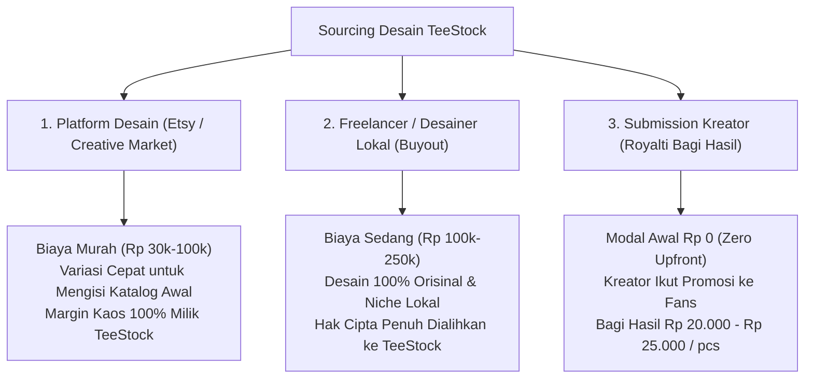

# 🎨 Panduan Kurasi Desain, Sourcing & Standar Lisensi HAKI — TeeStock

> [!abstract] Ringkasan Prinsip
> TeeStock memadukan model **Threadless & Cotton Bureau** ke dalam pasar Indonesia: menghadirkan ratusan pilihan desain terkurasi untuk semua kalangan dengan jaminan standar bahan katun New States Apparel (NSA) dan sablon in-house DTF 155°C.
> 
> Dokumen ini adalah SOP operasional untuk:
> 1. Strategi pengadaan desain (Beli Putus vs Royalti Kreator).
> 2. Standar teknis kelayakan cetak DTF (resolusi, transparansi, ketebalan garis).
> 3. Kerangka hukum lisensi & perlindungan HAKI (Anti-Copyright Infringement).

---

## 1. Tiga Jalur Pengadaan Desain (Design Sourcing Strategy)

Untuk membangun katalog dengan **banyak pilihan** tanpa membuat solo founder kehabisan modal di awal, TeeStock menerapkan bauran 3 sumber pengadaan:



### Komparasi 3 Jalur:

| Parameter | 1. Beli di Platform (Etsy/Marketplace) | 2. Freelance Custom (Buyout) | 3. Submission Kreator (Royalti) |
|---|---|---|---|
| **Modal Awal per Desain** | **Rp 30.000 – Rp 150.000** | **Rp 100.000 – Rp 250.000** | **Rp 0 (Nol Rupiah)** |
| **Bagi Hasil Penjualan** | 0% (Keuntungan 100% milik Anda) | 0% (Keuntungan 100% milik Anda) | **Rp 20.000 – Rp 25.000 / pcs** |
| **Keunikan / Orisinalitas** | Non-eksklusif (toko lain bisa beli aset sama) | 100% Eksklusif milik TeeStock | Eksklusif / Kurasi Kreator |
| **Dampak Pemasaran** | Mengandalkan traffic internal TeeStock | Mengandalkan traffic internal TeeStock | **Membawa audiens organik kreator** |
| **Waktu Pelaksanaan** | Cepat (Bisa download sekarang) | 2–5 hari pengerjaan | Bergantung submit berkala |

---

## 2. Standar Kualitas Teknis Desain (DTF Ready Pre-Flight Standards)

Agar hasil sablon pada mesin heat press in-house 155°C keluar tajam, awet saat dicuci, dan tidak mudah rontok, seluruh file desain wajib memenuhi **6 Syarat Teknis Baku**:

### 1. Format & Transparansi File
* **Format:** PNG 24-bit dengan background transparan (Alpha Channel murni).
* **Pantangan Keras:** Dilarang mengunggah file dengan kotak putih (*solid white bounding box*) atau background warna kaos yang di-rasterizer.

### 2. Resolusi & Dimensi Fisik (Print Size)
* **Resolusi:** Wajib **300 DPI** pada ukuran cetak aktual 1:1.
* **Dimensi Kanvas Cetak:**
  - **A3 Standar (Punggung / Dada Penuh):** Minimal $3.500 \times 4.800\text{ px}$ (Area efektif $28 \times 40\text{ cm}$).
  - **A4 Sedang (Dada Standar):** Minimal $2.500 \times 3.500\text{ px}$ (Area efektif $21 \times 30\text{ cm}$).
  - **A5/A6 (Logo Saku / Leher Depan):** Minimal $1.200 \times 1.800\text{ px}$ (Area efektif $10 \times 15\text{ cm}$).

### 3. Ketebalan Garis Minimum (Line Weight / Choke Threshold)
* Dalam sablon DTF, lem bubuk (*hot-melt adhesive powder*) membutuhkan area fisik untuk menempel.
* **Aturan Baku:** Garis paling tipis atau elemen teks terpisah minimal berukuran **1.5 mm (sekitar 4 pt)**. Garis rambut (*hairline*) di bawah 0.5 mm berisiko rontok pada pencucian ke-2 atau ke-3.

### 4. Mode Warna & Tinta Semi-Transparan (Glow / Feathering)
* **Profil Warna:** sRGB (RGB) dengan gamut pekat.
* **Perhatian Khusus Efek Glow / Smoke:** Sablon DTF mencetak tinta putih (*white underbase*) di belakang warna. Efek semi-transparan (seperti asap buram, bayangan lembut/drop shadow transparan 20%) akan dicetak dengan lapisan putih tipis yang tampak kusam/kasar.
* **SOP:** Gunakan teknik halftoning atau solid vector untuk efek bayangan/cahaya.

---

## 3. Kerangka Hukum, Lisensi & Manajemen Risiko HAKI

Sebagai solopreneur, tuntutan hak cipta adalah risiko terbesar jika tidak dipagari sejak hari pertama.

### A. Aturan Beli di Platform Luar (Etsy, Creative Market, Freepik)
1. **Wajib Memiliki Lisensi POD (Print-on-Demand Commercial License):**
   * Lisensi standar sering kali hanya untuk produk fisik yang Anda buat sendiri maksimal 500 pcs (*Crafting License*).
   * Pastikan deskripsi produk di Etsy secara eksplisit menyebutkan: *"Commercial Use for POD allowed"* atau beli *"Extended Commercial License"*.
2. **Aturan De-minimis & Modifikasi Kreatif:**
   * Jangan hanya mendownload 1 ilustrasi lalu langsung dicetak bulat-bulat tanpa perubahan.
   * Lakukan modifikasi kreatif (tambahkan elemen tipografi khas TeeStock, ganti susunan warna, padukan dengan kutipan bahasa Indonesia yang relevan).

### B. Aturan Beli Putus dari Freelancer (Work-for-Hire / Buyout)
Gunakan surat serah terima hak cipta sederhana yang memuat klausul:
> *"Pihak Kedua (Desainer) dengan ini menyerahkan seluruh hak ekonomi dan hak komersial atas karya [Nama Desain] secara eksklusif dan permanen kepada Pihak Pertama (TeeStock). Pihak Pertama berhak mencetak, memodifikasi, dan memperbanyak karya tersebut untuk produk apparel komersial tanpa kewajiban membayar royalti tambahan di masa mendatang."*

### C. Syarat & Ketentuan Submission Kreator (Program Kolaborasi)
Ketika membuka form penerimaan desain untuk kreator publik:
1. **Status Hak Cipta:** Hak cipta moral tetap milik kreator (Kreator tetap diakui sebagai pencipta dan portofolio mereka). TeeStock memegang **Lisensi Eksklusif Ritel Apparel selama 6 atau 12 bulan**.
2. **Klausul Ganti Rugi / Bebas Tuntutan (Indemnification Clause):**
   > [!important] Klausul Wajib Formulir Kreator
   > *"Kreator menyatakan dan menjamin dengan sebenarnya bahwa karya yang diserahkan adalah 100% orisinal ciptaan sendiri, bukan hasil plagiasi, comotan internet, atau pelanggaran hak cipta/merek dagang pihak ketiga (termasuk karakter anime berlisensi, logo brand, atau karya publik). Segala konsekuensi dan tuntutan hukum akibat pelanggaran HAKI sepenuhnya menjadi tanggung jawab kreator."*
3. **Blacklist Tema Terlarang:**
   - Dilarang keras fan-art Disney, Marvel, band major, atau logo resmi tanpa izin.
   - Dilarang konten SARA, pornografi eksplisit, dan ujaran kebencian.

---

## 4. Alur Kerja Praktis Kurasi Desain (SOP Solo Founder)

Untuk menjaga waktu Anda tetap efisien, proses kurasi tidak boleh rumit:

```
┌────────────────────────────────────────────────────────┐
│ 1. INBOX SUBMISSION (Google Form / Tally / WhatsApp)   │
│    Kreator upload mockup + link Google Drive file asli │
└───────────────────────────┬────────────────────────────┘
                            │
                            ▼
┌────────────────────────────────────────────────────────┐
│ 2. FILTER CEPAT 3 MENIT (Scoring Matrix 1-5)           │
│    • Apakah desainnya rapi & tidak murahan?            │
│    • Apakah cocok dengan salah satu niche TeeStock?    │
│    • Apakah lolos spek teknis 300 DPI & transparan?    │
└───────────────────────────┬────────────────────────────┘
                            │
              ┌─────────────┴─────────────┐
              ▼                           ▼
        [ LOLOS ]                   [ TIDAK LOLOS ]
              │                           │
              ▼                           ▼
┌───────────────────────────┐ ┌───────────────────────────┐
│ Kirim Notifikasi Selamat  │ │ Template email/WA santun: │
│ Masukkan ke katalog web   │ │ "Terima kasih, belum pas  │
│ Assign kode SKU & kreator │ │ dengan tema rilis kali ini│
└───────────────────────────┘ └───────────────────────────┘
```

### SOP Pembayaran Royalti Kreator:
* Menggunakan pencatatan transparan di panel admin TeeStock.
* **Jadwal Payout:** Ditransfer setiap tanggal 5 awal bulan (akumulasi penjualan bulan sebelumnya).
* **Minimal Payout:** Rp 100.000 (jika belum mencapai 4–5 kaos terjual, diakumulasikan ke bulan berikutnya agar hemat biaya transfer).
