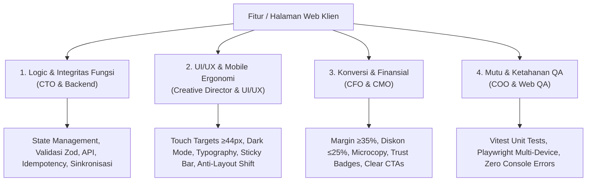

# Perencanaan Audit & Upgrade Komprehensif TeeStock Web Client

> [!abstract] Visi & Sasaran Eksekusi
> Dokumen ini adalah panduan kerja kolaboratif antara Founder (Rizky) dan C-Suite Cabinet AI untuk melakukan audit menyeluruh terhadap **Logic Fungsi Fitur**, **UI/UX Mobile-First**, serta **Tingkat Konversi Penjualan** pada website e-commerce **TeeStock Apparel** (`teestockapparel.vercel.app`).
> 
> Seluruh perbaikan mengacu pada 3 pilar guardrail:
> 1. **Mobile-First Priority**: 85%+ pengunjung mengakses via smartphone (Instagram/TikTok/WhatsApp) pada resolusi $360\text{px} - 430\text{px}$ dengan batas minimum touch target $44 \times 44\text{ px}$.
> 2. **CFO Financial Guardrail**: Margin bersih ritel apparel minimal 35%, batas maksimal voucher diskon 25%, dan transparansi ongkir tanpa kebocoran margin.
> 3. **Engineering Integrity**: 100% lulus unit testing Vitest, 100% lulus pengujian E2E Playwright (Desktop & Mobile Pixel 7), zero runtime console errors, dan Core Web Vitals (LCP < 2.0s, CLS < 0.1).

---

## 4 Dimensi Evaluasi pada Setiap Checkpoint

Setiap halaman/fitur dievaluasi melalui 4 kacamata spesialis:

1. **Dimensi 1: Logic & Fungsi Fitur (CTO Focus)**:
   - Ketepatan alur data (*state machine*), validasi skema form (Zod), penanganan nilai *null/undefined*.
   - Keamanan transaksi: idempotency order ID, verifikasi nomor WhatsApp Indonesia, fallback saat payment gateway pending.
   - Sinkronisasi data lokal (`localStorage`) dengan database Supabase.
2. **Dimensi 2: UI/UX & Mobile Experience (Creative Director Focus)**:
   - Ergonomi jempol (*thumb-zone accessibility*), touch target minimal $44\times 44\text{ px}$.
   - Keterbacaan teks dan kontras rasio (WCAG AA/AAA) pada tema Gelap dan Terang.
   - Penanganan benturan keyboard virtual mobile terhadap *sticky bottom bar*.
   - Kehalusan transisi (micro-interactions, loading skeleton, optimistic UI).
3. **Dimensi 3: Konversi & Guardrail Finansial (CFO & CMO Focus)**:
   - Pencegahan *buyer anxiety* melalui penempatan Customer Trust Badges, garansi retur 100%, dan estimasi waktu kirim (SLA).
   - Penegakan floor margin 35% dan pembatasan voucher diskon maksimal 25%.
   - Copywriting persuasif yang mengangkat keunggulan katun NSA 24s tubular knit dan sablon double-press 155°C.
4. **Dimensi 4: Kualitas & Pengujian QA (COO Focus)**:
   - Pembuatan unit test otomatis per modul logika (*business logic isolation*).
   - Pengujian end-to-end multi-perangkat Playwright (Desktop Chrome + Mobile Pixel 7).
   - Audit konsol peramban (*zero console warnings & zero runtime exceptions*).

---

## Peta Jalan 10 Checkpoint Sisi Klien (TeeStock Storefront)

| Checkpoint | Modul / Halaman | Rute Web | Fokus Utama Audit & Peningkatan |
|---|---|---|---|
| **C-01** | **Beranda & Studio Showcase** | `/` | 4 Trust Cards Ribbon, Komparasi NSA 24s vs 30s, Lookbook Hero swatch $\ge 44\text{px}$, SLA dispatch Depok, unit tests. |
| **C-02** | **Katalog & The Blanks NSA** | `/katalog` & `/polos` | Pemisahan grafis vs polos, kalkulator harga dasar NSA 3600/7200, 6 opsi sortir, Active Filter Chips Ribbon, unit tests. |
| **C-03** | **Product Detail Page (PDP)** | `/produk/:sku` | Galeri swipe mobile, selektor warna & size chip $\ge 44\text{px}$, sticky buy bar anti-keyboard collision, accordion spesifikasi NSA, interactive size chart helper. |
| **C-04** | **Keranjang & Checkout QRIS** | `/keranjang` | Formulir satu halaman (Single Page Checkout), validasi Zod WhatsApp, kupon voucher guardrail $\le 25\%$, kalkulasi ongkir ekspedisi, QRIS Midtrans & WA fallback, invoice success screen. |
| **C-05** | **Pelacakan Status Pesanan** | `/tracking` | Real-time status timeline (Pending $\rightarrow$ DTF $\rightarrow$ Press $\rightarrow$ Pack $\rightarrow$ Shipped), auto-resolver order lokal, proteksi 4-digit HP, 1-click copy resi kurir, tombol konfirmasi bayar WA. |
| **C-06** | **Atelier Custom Sablon** | `/custom-order` | Multi-step interactive custom quoter, selektor model kaos NSA & area cetak A3/A4/A5, pre-flight uploader (PNG 300 DPI), live mockup preview garmen, generator brief pesanan WA. |
| **C-07** | **Portal Kemitraan B2B** | `/partner` & `/mitra` | Simulator kalkulator margin bulanan interaktif, perbandingan tier Dropshipper vs Reseller VIP, formulir pendaftaran mitra, proteksi akses harga grosir di katalog. |
| **C-08** | **Garansi & Panduan Ukuran** | `/garansi` & `/care` | Tabel size chart resmi New States Apparel (S–3XL), visual care guide sablon DTF (cuci air dingin, balik pakaian, tanpa pemutih), alur formulir klaim retur ganti baru 100%. |
| **C-09** | **Panggung Kreator & Royalti** | `/creator` & `/kreator` | Simulator potensi royalti bersih (Rp 25.000 / kaos terjual), spesifikasi teknis artwork siap cetak (RGB/CMYK transparan), formulir submit desain, FAQ jadwal transfer royalti. |
| **C-10** | **Akun, Bio Link & Global Shell** | `/akun`, `/bio`, Layout | Profil member & tab riwayat order lokal, standalone mobile bio link (TikTok/IG traffic), StoreNavbar search dialog, drawer menu mobile $375\text{px}$, StoreFooter trust badges. |

---

## Rincian Perencanaan Setiap Checkpoint

### Checkpoint C-01: Beranda & Studio Showcase (`HomePage.jsx`)
- **Tujuan**: Menghilangkan keraguan calon pembeli baru dalam 5 detik pertama dan mengarahkan mereka ke koleksi produk.
- **Audit Logic & Fitur**:
  - Validasi pemilihan otomatis featured product aktif untuk Hero Lookbook.
  - Ekstraksi swatch warna yang aman dari metadata produk.
  - JSON-LD Structured Data Schema `ClothingStore` valid untuk Google Rich Results.
- **Audit UI/UX**:
  - Penambahan **Pita Jaminan 4 Pilar (`HomeTrustRibbon.jsx`)** (100% NSA Original, 155°C Dual-Heat, Dispatch H+0/H+1, Garansi Retur 100%).
  - Penambahan **Komparasi Bahan Interaktif (`HomeFabricComparison.jsx`)** (NSA 24s Heavyweight 180 GSM vs NSA 30s Softstyle 150 GSM).
  - Peningkatan ukuran tap area warna di Hero menjadi $\ge 44\times 44\text{ px}$.
- **Status Eksekusi**: 🟢 **Selesai (Commit `4860560`, 111 unit tests passed, 26 E2E passed)**.

---

### Checkpoint C-02: Katalog & The Blanks NSA (`CatalogPage.jsx`)
- **Tujuan**: Memudahkan navigasi pencarian produk baik untuk pembeli kaos grafis maupun pembeli kaos polos grosir/eceran.
- **Audit Logic & Fitur**:
  - Pemisahan data murni: `filterCatalogProducts` dan `sortCatalogProducts`.
  - Kalkulasi harga akurat pada kaos polos NSA via `getProductBasePrice` (NSA 3600 Rp 34.000 vs NSA 7200 Rp 49.000).
  - 6 opsi pengurutan: Rekomendasi, Best Seller, Rilis Terbaru, Harga Rendah-Tinggi, Harga Tinggi-Rendah, Nama A-Z.
  - Sinkronisasi query param URL `?series=...` yang bersih tanpa meninggalkan filter usang saat berganti tab.
- **Audit UI/UX**:
  - Penambahan **Active Filter Chips Ribbon** dengan penghitung produk live (`role="status"`) dan tombol reset filter satu-klik.
  - Peningkatan touch target swatch warna dan tombol aksi di `ProductCard.jsx`.
- **Status Eksekusi**: 🟢 **Selesai (Commit `931399e`, 122 unit tests passed, 26 E2E passed)**.

---

### Checkpoint C-03: Product Detail Page (PDP) (`ProductDetailPage.jsx`)
- **Tujuan**: Memaksimalkan rasio konversi klik-ke-keranjang (*Add to Cart rate*) dengan transparansi spesifikasi garmen.
- **Audit Logic & Fitur**:
  - Kalkulasi dinamis harga eceran vs harga promo vs harga mitra reseller (`isPartner`).
  - Penentuan dynamic SLA status per warna: Hitam/Putih (*⚡ H+0 Dispatch Studio Depok*) vs Warna Khusus (*📦 H+1 Buffer Gudang NSA*).
  - Validasi stok habis (*out of stock*) per kombinasi warna & ukuran garmen.
  - JSON-LD Structured Data Schema `Product` lengkap dengan SKU, ketersediaan, dan penawaran harga.
- **Audit UI/UX**:
  - Galeri visual gambar multi-sudut dengan indikator thumbnail dan swipe gesture di smartphone.
  - Selektor varian warna & ukuran dengan touch target lebar $\ge 44\times 44\text{ px}$ dan visual feedback jelas.
  - **Sticky Bottom Buy Bar**: Tombol *"Beli Sekarang"* & *"Tambah Keranjang"* yang selalu melayang di bagian bawah layar smartphone tanpa bentrok saat keyboard terbuka.
  - Accordion spesifikasi teknik: Detail bahan NSA (100% ringspun cotton, tubular knit built-up tanpa sambungan samping, rib 2.2 cm anti-mekar).
  - Modal panduan ukuran (*Interactive Size Chart Helper*): Membantu pembeli memilih size berdasarkan Tinggi Badan (TB) dan Berat Badan (BB).

---

### Checkpoint C-04: Keranjang, Diskon Voucher & Checkout QRIS (`CartPage.jsx`)
- **Tujuan**: Menghilangkan friksi checkout, mencegah keranjang terbengkalai (*abandoned cart*), dan memastikan uang masuk ke rekening kas.
- **Audit Logic & Fitur**:
  - Validasi formulir pengiriman menggunakan **Zod Schema**:
    - Nomor WhatsApp Indonesia wajib diawali `08`, `+62`, atau `62` dengan panjang 10–14 digit.
    - Kelengkapan alamat penerima (Nama, Alamat Lengkap, Kota/Kecamatan, Kode Pos).
  - **CFO Guardrail Mesin Voucher**:
    - Batas diskon maksimal 25% dari subtotal barang.
    - Validasi syarat minimum order belanja.
    - Penolakan voucher kedaluwarsa atau kode salah dengan pesan error yang ramah.
  - **Adapter Pembayaran Terintegrasi**:
    - Mode Otomatis: Midtrans Snap SDK (QRIS Dinamis Gopay/OVO/ShopeePay/BCA).
    - Mode Fallback: WhatsApp Direct Order dengan kode unik rupiah otomatis untuk memudahkan rekonsiliasi manual.
  - **Idempotency Guard**:
    - Pembuatan nomor pesanan unik (`TS-YYYYMMDD-XXXX`) untuk mencegah double-order saat tombol checkout ditekan berulang kali.
- **Audit UI/UX**:
  - Single-Page Checkout flow: Keranjang dan form alamat berada dalam satu alur mulus tanpa pengalihan halaman yang membingungkan.
  - Indikator ringkasan biaya transparan: Subtotal Kaos, Potongan Diskon Voucher, Ongkir Kurir, dan Total Tagihan.
  - Layar konfirmasi sukses (*Order Complete Screen*): Menampilkan rincian pesanan, instruksi pembayaran, dan tombol langsung ke halaman pelacakan status pesanan.

---

### Checkpoint C-05: Pelacakan Status Pesanan Real-time (`OrderTrackingPage.jsx`)
- **Tujuan**: Memberikan ketenangan pikiran (*post-purchase reassurance*) dan mereduksi beban chat CS operasional.
- **Audit Logic & Fitur**:
  - Sinkronisasi status order dari Supabase / state antrean studio (`pending` $\rightarrow$ `dtf` $\rightarrow$ `press` $\rightarrow$ `pack` $\rightarrow$ `shipped` $\rightarrow$ `completed`).
  - Auto-resolver order lokal: Membaca riwayat pesanan dari `localStorage` (`teestock_my_orders`) saat parameter URL `?order=...` terbuka.
  - Proteksi verifikasi nomor WhatsApp: Hanya menampilkan data sensitif setelah 4-digit nomor HP diverifikasi.
- **Audit UI/UX**:
  - Visual timeline progress bar yang estetik dengan ikon status per tahapan produksi studio.
  - Kotak nomor resi ekspedisi dengan tombol **One-Click Copy** dan tautan cek resi kurir (J&T, SiCepat, JNE).
  - Tombol aksi cepat *"Hubungi Studio via WA"* jika pesanan membutuhkan konfirmasi bukti transfer atau revisi alamat.

---

### Checkpoint C-06: Atelier Studio Custom Sablon Satuan (`CustomOrderPage.jsx`)
- **Tujuan**: Menyediakan laboratorium sablon DTF instan bagi komunitas, brand independen, dan kreator tanpa batasan minimal order.
- **Audit Logic & Fitur**:
  - Kalkulator kuotasi instan:
    - Pilihan garmen: NSA 7200 (24s Heavyweight) vs NSA 3600 (30s Softstyle) vs Kaos Bawa Sendiri.
    - Pilihan area cetak sablon: A3 Punggung ($28\times 40\text{ cm}$), A4 Dada ($21\times 30\text{ cm}$), A5 ($14\times 20\text{ cm}$), atau Logo Saku ($9\times 9\text{ cm}$).
    - Jumlah sisi cetak (1 sisi vs 2 sisi depan-belakang).
    - Diskon kuantiti otomatis: 1-5 pcs (Satuan), 6-23 pcs (Komunitas), $\ge 24$ pcs (Partai/Grosir).
  - Generator brief pesanan studio: Format pesan WhatsApp terstruktur dengan spesifikasi teknis lengkap.
- **Audit UI/UX**:
  - Multi-step configurator interaktif yang intuitif di layar smartphone.
  - Pre-flight upload box dengan panduan resolusi (300 DPI, format PNG transparan, tanpa background putih).
  - Live mock-up preview garmen yang memperlihatkan perkiraan letak sablon di atas kaos.

---

### Checkpoint C-07: Portal Kemitraan Reseller & Dropship (`PartnerPage.jsx`)
- **Tujuan**: Mendorong pertumbuhan jaringan distribusi B2B dan reseller independen dengan transparansi margin keuntungan.
- **Audit Logic & Fitur**:
  - Simulator keuntungan reseller interaktif:
    - Input target penjualan per hari/bulan $\times$ selisih harga retail vs harga mitra.
    - Estimasi laba bersih bulanan yang dapat dikantongi mitra.
  - Formulir pendaftaran mitra: Validasi data pendaftar (Nama, WhatsApp, Kota Domisili, Channel Penjualan IG/TikTok/Shopee).
- **Audit UI/UX**:
  - Komparasi fasilitas Tiering: **Paket Dropshipper** (Modal Rp 0, kirim atas nama brand mitra) vs **Paket Reseller VIP** (Harga grosir terendah, prioritas antrean studio, bonus sample pack).
  - FAQ kemitraan yang menjawab keraguan seputar pengiriman, katalog foto produk polos, dan retur garansi.

---

### Checkpoint C-08: Garansi, Panduan Bahan & Ukuran (`GaransiPage.jsx`)
- **Tujuan**: Menjawab keberatan (*objection handling*) calon pembeli seputar ukuran yang salah dan ketahanan sablon.
- **Audit Logic & Fitur**:
  - Logika kalkulator konversi ukuran (panduan rekomendasi ukuran berdasarkan input TB dan BB pengunjung).
  - Validasi formulir klaim garansi: Pilihan jenis kendala (cacat jahitan kain, sablon retak/mengelupas, atau salah kirim ukuran).
- **Audit UI/UX**:
  - Tabel size chart New States Apparel lengkap dengan visual siluet kaos (Lebar Dada, Panjang Baju, Panjang Lengan) untuk size S hingga 3XL.
  - Visual *Garment Care Infographic*: 4 aturan mencuci kaos sablon DTF agar awet bertahun-tahun.
  - Banner komitmen **Garansi Retur 100%**: Penggantian barang baru secara gratis jika terjadi cacat produksi dari studio kami.

---

### Checkpoint C-09: Panggung Kreator & Royalti Mandiri (`CreatorPage.jsx`)
- **Tujuan**: Mengakselerasi flywheel penambahan desain baru tanpa modal pengadaan aset bagi kreator.
- **Audit Logic & Fitur**:
  - Kalkulator royalti interaktif: Simulasi target penjualan drop $\times$ royalti bersih Rp 25.000 / pcs kaos.
  - Validasi form pendaftaran karya kreator (Link portofolio/Instagram, upload draf artwork, kontak WhatsApp).
- **Audit UI/UX**:
  - Narasi kolaborasi yang memberdayakan: *"Kamu fokus menggambar & bercerita, TeeStock yang menanggung stok garmen, sablon, kemasan, hingga kirim ke seluruh Indonesia."*
  - Panduan teknis artwork: RGB vs CMYK, 300 DPI, batasan detail garis raster.
  - FAQ hak cipta yang menegaskan bahwa kepemilikan hak kekayaan intelektual (IP) tetap 100% milik kreator.

---

### Checkpoint C-10: Area Member, Bio Link & Global Shell (`AccountPage.jsx`, `BioLinkPage.jsx`, Layout)
- **Tujuan**: Membangun retensi pelanggan jangka panjang dan kanal rujukan media sosial berkecepatan tinggi.
- **Audit Logic & Fitur**:
  - Tab riwayat pesanan member berbasis `localStorage` dan login Supabase.
  - Standalone routing `/bio`: Micro-landing page yang dimuat di bawah 0.8 detik untuk traffic bio link TikTok dan Instagram.
  - Pencarian global di `StoreNavbar.jsx` dengan debounce dan overlay modal.
- **Audit UI/UX**:
  - Drawer navigasi mobile ($375\text{px}$): Menu yang mudah dijangkau satu tangan dengan touch target $\ge 44\text{px}$.
  - Toggle switch Dark Mode / Light Mode yang mulus tanpa kedip (*flash of unstyled content*).
  - `StoreFooter.jsx`: Ringkasan channel pembayaran resmi (QRIS, BCA, Mandiri), kurir ekspedisi resmi, link WhatsApp CS, dan form newsletter The Archive Club.

---

## Rencana Verifikasi & Standar Kelulusan Setiap Checkpoint

Setiap checkpoint dinyatakan **LULUS (Passed)** apabila memenuhi 4 tahap uji bertingkat:

1. **Tahap 1 — Unit Testing (`npm test`)**:
   - Seluruh test suite Vitest pada modul terkait lulus 100% tanpa ada yang diskip.
2. **Tahap 2 — Production Build (`npm run build`)**:
   - Tidak ada error kompilasi TypeScript/Vite, tidak ada circular dependencies, dan ukuran bundle tetap teroptimasi.
3. **Tahap 3 — Playwright Multi-Device E2E (`npm run audit:e2e`)**:
   - Lulus 26 skenario pengujian pada:
     - **Desktop Chrome** ($1280\text{px} \times 720\text{px}$)
     - **Mobile Chrome (Pixel 7)** ($412\text{px} \times 915\text{px}$)
   - Konsol peramban bersih dari runtime errors (`error` logs = 0).
4. **Tahap 4 — Git Commit & Push**:
   - Commit deskriptif berstandar Conventional Commits (`feat(storefront): checkpoint X - ...`) dan di-push ke branch `origin main`.
5. **Tahap 5 — Dokumentasi**:
   - Pencatatan sebelum-dan-sesudah di `walkthrough.md` dan pembaruan status di `implementation_plan.md`.
