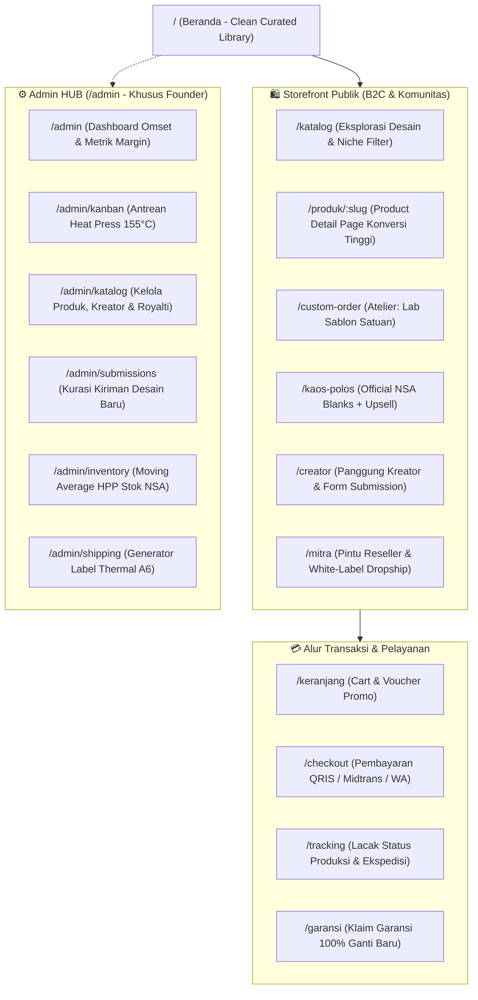
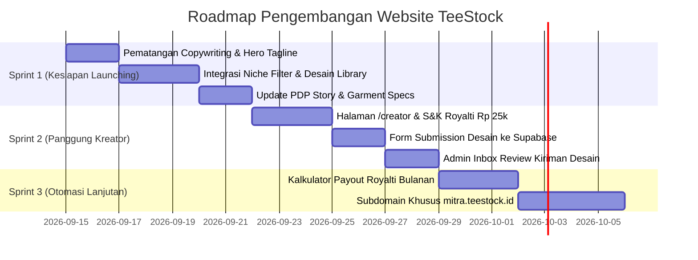

# 🌐 Master Blueprint Perencanaan Website TeeStock

> [!abstract] Visi & Peran Website
> Website **TeeStock** ([`teestock.vercel.app`](https://teestock.vercel.app)) dirancang bukan sekadar sebagai toko online biasa, melainkan sebagai **The Digital Curated Apparel House & Creator Launchpad** (mengadopsi pengalaman terbaik *Threadless* & *Cotton Bureau* dengan kearifan pasar Indonesia).
> 
> Website ini menjalankan 3 fungsi vital:
> 1. **Galeri Desain Terkurasi (Consumer Storefront):** Menyajikan ratusan pilihan desain visual berkarakter secara rapi, ramah, dan mudah dijelajahi oleh semua kalangan.
> 2. **Panggung Kreator (Creator Engine):** Kanal rekrutmen dan penerimaan karya (*submission*) seniman/ilustrator independen dengan transparansi royalti.
> 3. **Studio Operasional Solo Founder (Admin HUB):** Pusat kendali pemrosesan pesanan, heat press 155°C, kontrol stok bahan NSA, dan pencetakan resi thermal A6.

---

## 🗺️ 1. Peta Situs & Information Architecture (IA)

Struktur halaman ditata dalam hierarki yang jelas antara **Etalase Konsumen**, **Pintu Kreator**, dan **Panel Admin Studio**:



---

## 📄 2. Perencanaan Detail Halaman Utama

### A. Beranda (`/` — The Clean Curated Library)
* **Hero Section:**
  - Headline: *"Banyak Pilihan Desain, Satu Standar Kualitas."*
  - Sub-headline: *"Ratusan karya grafis terkurasi untuk sehari-hari. Dicetak di atas katun murni New States Apparel 24s tubular knit dengan in-house double-press 155°C di studio Citayam."*
  - CTA Ganda: `[ Jelajahi Koleksi Desain ]` & `[ Mau Kaos Polos / Custom? ]`
  - Live Trust Ticker: `✓ 100% Katun NSA Original • ✓ Kerah Anti-Melar 2.2 cm • ✓ Garansi Retur 100%`
* **Niche Category Filter Pills (Horizontal Scrollable):**
  - Tab instan: `Semua`, `☕ Kopi & Kafe`, `💻 Tech & Coding`, `🐱 Anak Bulu`, `😂 Humor Santai`, `🏔️ Outdoor`, `🖋️ Tipografi`, `👕 Polosan (Blanks)`.
* **The Craftsmanship Bento Grid:**
  - Edukasi visual transparan: Spesifikasi NSA 24s 180 GSM, jahitan tubular tanpa sambungan samping, dan teknik sablon DTF elastis 155°C.
* **Featured Drops & Curated Creator Highlights:**
  - Menampilkan 8–12 desain pilihan minggu ini dengan foto mockup realistis dan nama kreator di bawah kartu produk.
* **The Honest Price Comparison:**
  - Perbandingan harga transparan D2C Online (Rp 99.000) vs Distro Mall (Rp 180.000+).

---

### B. Katalog Desain (`/katalog`)
* **Sistem Navigasi & Filter Multi-Dimensi:**
  1. *Berdasarkan Niche / Minat:* Hobi, Profesi, Humor, Musik, Tipografi.
  2. *Berdasarkan Garmen:* NSA 7200 Heavyweight 24s vs NSA 3600 Softstyle 30s.
  3. *Berdasarkan Warna Kaos:* Hitam, Putih, Navy, Maroon, Forest Green.
  4. *Berdasarkan Tipe:* Karya Kurasi TeeStock, Kolaborasi Kreator, Kaos Polos.
* **Komponen Kartu Produk (`ProductCard`):**
  - Foto mockup tampak depan/belakang dengan hover preview.
  - Tag lencana: `[Curated Originals]`, `[Karya: NamaKreator]`, atau `[Official Blank]`.
  - Judul desain berselera + Harga ritel (`Rp 99.000` dengan anchor price coret `Rp 139.000`).
  - Rating bintang (4.9/5) & indikator stok buffer (*Siap Kirim Hari Ini* vs *Produksi H+1*).

---

### C. Halaman Detail Produk (`/produk/:slug` — PDP Konversi Tinggi)
* **Galeri Foto:** Mockup detail tekstur kain, close-up sablon DTF, foto saat dikenakan model kasual, dan foto label inner-neck print studio.
* **Story di Balik Karya:**
  - Paragraf singkat yang menceritakan inspirasi karya dan profil singkat ilustrator pembuatnya.
* **Interactive Garment Specs Selector:**
  - Pilihan warna kaos (swatches visual).
  - Pilihan ukuran (S, M, L, XL, XXL) dilengkapi **Interactive Size Finder** (input tinggi/berat badan $\rightarrow$ rekomendasi size instan).
* **Feature-to-Benefit Guarantee Box:**
  - Garansi 100% ganti baru jika sablon cacat atau kerah melar saat unboxing.
* **Sticky Mobile CTA Bar:**
  - Tombol aksi mengambang di layar HP: `[ Masukkan Keranjang - Rp 99.000 ]`.

---

### D. Halaman Panggung Kreator (`/creator` — Creator Engine)
* **Manifesto & Penawaran:**
  - Headline: *"Panggung untuk Karyamu. Tanpa Modal, Tanpa Ribet Produksi."*
  - Penjelasan skema royalti transparan: **Rp 25.000 per kaos terjual**.
* **Alur Sederhana:**
  1. Submit desainmu (PNG 300 DPI transparan).
  2. Lolos kurasi standar TeeStock dalam 1x24 jam.
  3. Desain tayang di website dan dipromosikan ke pembeli.
  4. Royalti ditransfer setiap tanggal 5 awal bulan.
* **Form Submission Desain Terintegrasi:**
  - Input: Nama Lengkap, Akun Medsos (IG/X/Portfolio), Nomor WhatsApp, Nomor Rekening.
  - Upload file mockup preview + Link Google Drive untuk file master PNG 300 DPI.
  - Checkbox Persetujuan Legal: *"Saya menjamin karya ini 100% orisinal dan bukan hasil plagiasi/pelanggaran HAKI."*

---

### E. Halaman Custom Atelier (`/custom-order`)
* **Fungsi:** Mengakomodasi pesanan satuan & komunitas tanpa membuat founder repot bolak-balik chat manual.
* **Form Spesifikasi 4 Langkah:**
  1. *Pilih Bahan:* NSA 24s Heavyweight atau NSA 30s Softstyle.
  2. *Pilih Ukuran & Posisi Sablon:* A3 Belakang, A4 Depan, atau Logo Saku Dada.
  3. *Upload File Desain:* Validasi otomatis (peringatan jika file di bawah 300 DPI).
  4. *Kalkulasi Harga Instan & Action Button:* Menampilkan total biaya transparan $\rightarrow$ Tombol `[ Lanjutkan Pesanan ke WhatsApp ]` dengan pesan otomatis terformat rapi.

---

### F. Halaman Kaos Polos (`/kaos-polos`)
* Menampilkan katalog resmi New States Apparel (NSA 7200 & 3600) untuk kebutuhan eceran basic wear.
* **Upsell Banner 1-Klik:** *"Mau kaos polos ini disablon desainmu sendiri? Tambah Rp 25.000 saja!"* $\rightarrow$ langsung membuka modal custom.

---

## 🛠️ 3. Arsitektur Teknologi & Tech Stack

```
┌────────────────────────────────────────────────────────────────────────┐
│                          FRONTEND (CLIENT SPA)                         │
│   React 18 + Vite + Tailwind CSS + Lucide Icons + React Router v6      │
│   • State Management: Zustand (Cart & UI) + React Query (Cache API)    │
│   • Hosting: Vercel (Edge Network CDN, Sub-second TTFB)               │
└───────────────────────────────────┬────────────────────────────────────┘
                                    │
                                    ▼
┌────────────────────────────────────────────────────────────────────────┐
│                        BACKEND AS A SERVICE (BaaS)                     │
│   Supabase (PostgreSQL 15 + Row Level Security + Auth + Edge Functions)│
│   • Tabel: products, creators, submissions, orders, inventory, ledger  │
│   • Storage / CDN: Cloudinary (Transformasi gambar & mockup dinamis)   │
└───────────────────────────────────┬────────────────────────────────────┘
                                    │
         ┌──────────────────────────┴──────────────────────────┐
         ▼                                                     ▼
┌───────────────────────────────────┐ ┌───────────────────────────────────┐
│     PAYMENT & NOTIFIKASI          │ │        LOGISTIK & EXPEDISI        │
│ • Midtrans (QRIS Dinamis 0.7%)    │ │ • RajaOngkir / Biteship API       │
│ • Fonnte / WhatsApp Gateway API   │ │ • Generator Label Thermal A6      │
└───────────────────────────────────┘ └───────────────────────────────────┘
```

---

## 🗄️ 4. Peningkatan Skema Database (Supabase Schema Update)

Untuk mendukung pilar kolaborasi kreator dan royalti, skema database master ditambahkan entitas berikut:

```sql
-- 1. Tabel Profil Kreator
CREATE TABLE IF NOT EXISTS public.ts_creators (
    id UUID PRIMARY KEY DEFAULT gen_random_uuid(),
    name VARCHAR(255) NOT NULL,
    slug VARCHAR(100) UNIQUE NOT NULL,
    bio TEXT,
    instagram VARCHAR(100),
    avatar_url TEXT,
    bank_name VARCHAR(100),
    bank_account VARCHAR(100),
    bank_holder VARCHAR(255),
    total_sales_count INT DEFAULT 0,
    created_at TIMESTAMPTZ DEFAULT NOW()
);

-- Enable RLS
ALTER TABLE public.ts_creators ENABLE ROW LEVEL SECURITY;
CREATE POLICY "ts_creators_select_public" ON public.ts_creators FOR SELECT USING (true);

-- 2. Tambahan Kolom di Tabel ts_products
ALTER TABLE public.ts_products 
ADD COLUMN IF NOT EXISTS creator_id UUID REFERENCES public.ts_creators(id) ON DELETE SET NULL,
ADD COLUMN IF NOT EXISTS creator_name VARCHAR(255),
ADD COLUMN IF NOT EXISTS royalty_amount NUMERIC(10,2) DEFAULT 25000,
ADD COLUMN IF NOT EXISTS story_behind TEXT;

-- 3. Tabel Kiriman Desain Baru (Submissions)
CREATE TABLE IF NOT EXISTS public.ts_creator_submissions (
    id UUID PRIMARY KEY DEFAULT gen_random_uuid(),
    creator_name VARCHAR(255) NOT NULL,
    creator_email VARCHAR(255),
    creator_whatsapp VARCHAR(50) NOT NULL,
    design_title VARCHAR(255) NOT NULL,
    niche_category VARCHAR(100) NOT NULL,
    mockup_url TEXT,
    master_drive_link TEXT NOT NULL,
    status VARCHAR(30) DEFAULT 'pending' CHECK (status IN ('pending', 'approved', 'rejected')),
    reviewer_notes TEXT,
    agreed_to_terms BOOLEAN NOT NULL DEFAULT FALSE,
    created_at TIMESTAMPTZ DEFAULT NOW()
);

-- Enable RLS
ALTER TABLE public.ts_creator_submissions ENABLE ROW LEVEL SECURITY;
CREATE POLICY "ts_creator_submissions_insert_public" ON public.ts_creator_submissions FOR INSERT WITH CHECK (true);
```

---

## 🚀 5. Roadmap Pelaksanaan Pengembangan Website

Sebagai solopreneur dengan waktu terbagi, pengembangan dibagi menjadi **3 Sprint Terukur**:



### Prioritas Minggu Ini (Sprint 1):
1. **Perbarui Teks Hero & Copywriting Storefront:** Masukkan tagline *"Banyak Pilihan Desain, Satu Standar Kualitas"* dan hilangkan kesan elitis.
2. **Aktifkan Filter Niche di Halaman Katalog:** Pastikan pembeli bisa memfilter kaos berdasarkan hobi, kopi, coding, dan kucing.
3. **Uji Coba Alur Checkout & WhatsApp Flow:** Pastikan pesanan masuk mulus dari web ke WhatsApp/Midtrans.
