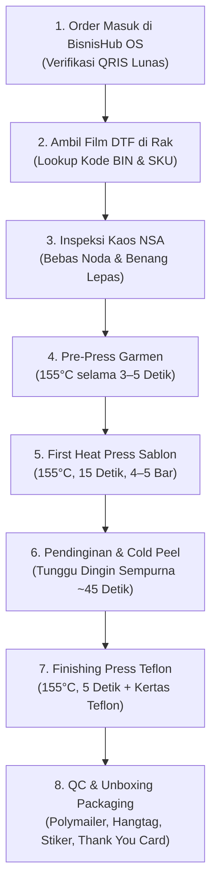

# SOP Penyimpanan Film DTF & Panduan Presisi Posisi Heat Press

> [!abstract] Ringkasan Eksekutif
> Dokumen ini adalah panduan standar operasional (**Standard Operating Procedure**) untuk studio in-house TeeStock Apparel. Memastikan bahwa setiap lembar film DTF (*Direct-to-Film*) hasil cetak roll 58 cm dapat **ditemukan dalam < 10 detik** melalui sistem pengkodean Bin-SKU fisik, serta menjamin **akurasi posisi penempelan sablon** pada kaos New States Apparel (NSA) tanpa miring atau salah letak menggunakan panduan jarak jari/sentimeter dan mockup visual.

---

## 1. Alur Produksi End-to-End Studio (7 Langkah)

Alur kerja harian founder dari pesanan masuk di [[apps/bisnishub-web/README|BisnisHub OS]] hingga penyerahan kurir:



---

## 2. Sistem Pengarsipan Fisik Film DTF (Sistem SKU & Bin)

Untuk mencegah film DTF tertekuk, tergores, serbuk lem menempel satu sama lain, atau hilang di tumpukan studio, TeeStock menerapkan **Sistem Rak Bin Berbasis Kategori Seri & SKU**.

### A. Format Label Fisik pada Map Film

Setiap kantong atau laci penyimpanan wajib ditempeli label fisik standar:

$$\mathbf{[KODE\text{ }BIN]\text{ }\bullet\text{ }[SKU\text{ }PRODUK]\text{ }\bullet\text{ }[POSISI\text{ }\&\text{ }UKURAN]}$$

*Contoh Label Fisik:*
- `BIN-A1 • TS-STM-001 • BACK A3+ (28x40 cm)`
- `BIN-A2 • TS-STM-002 • FRONT A4 (20x28 cm)`
- `BIN-D1 • TS-PRO-001 • HERO BACK A3+ (28x40 cm)`
- `BIN-X1 • TS-CUST-089 • CUSTOM CHEST A3`

---

### B. Struktur Pembagian Bin Rak Studio

| Kode Bin | Kategori Desain | Wadah Fisik | Kapasitas Rekomendasi |
|---|---|---|---|
| **BIN-A** | **Statement Series** (`TS-STM-xxx`) | Map Binder Zipper A3 / Clear Book 40 Pocket | 30–40 lembar film |
| **BIN-B** | **Subculture Series** (`TS-SUB-xxx`) | Map Binder Zipper A3 / Clear Book 40 Pocket | 30–40 lembar film |
| **BIN-C** | **Outlaw & Racing** (`TS-OUT-xxx`) | Map Binder Zipper A3 / Clear Book 40 Pocket | 30–40 lembar film |
| **BIN-D** | **Creator Collab** (`TS-PRO-xxx`, `TS-LOK-xxx`) | Map Binder Zipper A3 / Clear Book 40 Pocket | 20–30 lembar film |
| **BIN-E** | **Logo Saku & Tag Kerah** (A6 / 9x9 cm) | Kotak Sekat Akrilik / Box File Mini | 100+ pcs potongan kecil |
| **BIN-X** | **Pesanan Custom Khusus** (`TS-CUST-xxx`) | Folder Gantung Zipper Map Kuning | Sesuai antrean cetak JIT |

---

### C. SOP Perawatan & Perlindungan Lembar Film

> [!important] Aturan Wajib Penyimpanan Film DTF:
> 1. **Kertas Pembatas Anti-Lengket (*Interleaving Paper*)**:
>    - Di antara setiap lembar film DTF, selipkan **selembar kertas dorslag (kertas roti / baking paper tipis)**.
>    - Serbuk lem panas (*hot-melt adhesive powder*) pada bagian belakang film bersifat higroskopis dan dapat saling merekat jika ditumpuk tanpa pembatas saat cuaca lembap.
> 2. **Pengendalian Suhu & Kelembapan**:
>    - Simpan binder/box film pada ruangan ber-AC atau ruangan kering dengan **suhu $\le 25^\circ\text{C}$ dan kelembapan udara (RH) $\le 50\%$**.
>    - Selipkan **2–3 sachet Silica Gel Oxy/Gel** di setiap map binder untuk menyerap uap air tropis.
> 3. **Bebas Debu & Partikel Kasar**:
>    - Simpan selalu dalam map bertutup atau laci tertutup. Debu yang menempel pada lapisan lem akan menciptakan bintik putih atau rongga saat dipress ke kaos.
> 4. **Jangan Pernah Menggulung Ketat Film Jadi**:
>    - Film DTF yang sudah ditaburi lem dan di-oven harus disimpan dalam keadaan **datar horizontal (*flat*)**, bukan digulung kecil, agar lem tidak rontok atau pecah-pecah (*cracking*).

---

## 3. Panduan Presisi Posisi Desain saat Heat Press

Untuk memastikan sablon tidak miring, tidak terlalu tinggi menabrak kerah, atau terlalu rendah menyentuh perut, gunakan **Aturan Jari & Patokan Sentimeter Baku**:

```
                              ┌──────────────┐
                              │  KERAH LEHER │
                              └──┬────────┬──┘
                                 │ 3-4    │
                                 │ JARI   │
                  ┌──────────────┴────────┴──────────────┐
                  │                                      │
                  │         [A] DADA TENGAH A4/A3        │
                  │            (7 - 8 cm)                │
 ┌──────────────┐ │                                      │ ┌──────────────┐
 │              │ ├──────────────────────────────────────┤ │              │
 │  [D] LENGAN  │ │                                      │ │  [B] POCKET  │
 │   (5 cm dari │ │                                      │ │  DADA KIRI   │
 │    keliman)  │ │                                      │ │ (Sejajar     │
 └──────────────┘ │                                      │ │  Ketiak)     │
                  │                                      │ └──────────────┘
                  │                                      │
                  │                                      │
                  └──────────────────────────────────────┘
                               TAMPAK DEPAN
```

```
                              ┌──────────────┐
                              │ KERAH BELKG  │
                              └──┬────────┬──┘
                                 │ 1 JARI │ -> [E] NAPE / TAG LEHER (2.5 - 3 cm)
                                 │ 4 JARI │
                  ┌──────────────┴────────┴──────────────┐
                  │                                      │
                  │                                      │
                  │      [C] HERO PUNGGUNG A3+           │
                  │         (10 - 12 cm)                 │
                  │         (Lebar 28-30 cm)             │
                  │                                      │
                  │                                      │
                  │                                      │
                  └──────────────────────────────────────┘
                              TAMPAK BELAKANG
```

### Tabel Standar Jarak Fisik Penempatan Sablon:

| Titik Cetak | Dimensi Cetak | Jarak Fisik Acuan | Aturan Penggaris / Jari |
|---|---|---|---|
| **[A] Dada Penuh (Center Front)** | A4 ($21 \times 29\text{ cm}$) atau A3 ($29 \times 40\text{ cm}$) | 7–8 cm dari jahitan kerah bawah depan | **3–4 jari orang dewasa** merapat di bawah kerah |
| **[B] Logo Saku Dada Kiri (Left Chest)** | A6 ($8 \times 8\text{ cm}$ s.d. $10 \times 10\text{ cm}$) | 18–20 cm dari puncak bahu kiri, 7–9 cm ke kiri dari garis tengah | Tarik garis imajiner horizontal **sejajar dengan lipatan ketiak kiri** |
| **[C] Hero Punggung (Back A3+)** | A3+ ($28 \times 40\text{ cm}$ s.d. $30 \times 42\text{ cm}$) | 10–12 cm dari jahitan kerah belakang | **4 jari orang dewasa** di bawah garis kerah belakang |
| **[D] Lengan Kiri/Kanan (Sleeve)** | Maksimal $8 \times 8\text{ cm}$ | 4–5 cm di atas jahitan keliman ujung lengan | Di tengah lipatan simetris lengan |
| **[E] Leher Belakang (Nape / Neck)** | $5 \times 3\text{ cm}$ s.d. $7 \times 5\text{ cm}$ | 2.5–3 cm di bawah kerah belakang | **1–1.5 jari** di bawah kerah |

> [!tip] Trik Menemukan Garis Tengah Kaos (*Center Crease*):
> Sebelum meletakkan film, lipat kaos menjadi dua secara vertikal (pertemukan jahitan bahu kiri dan kanan), lalu lakukan **pre-press selama 3 detik**. Hasil press lipatan tersebut akan menciptakan garis tipis di tengah kaos yang menjadi panduan akurat untuk meluruskan titik tengah film DTF tanpa perlu mengukur bolak-balik dengan meteran.

---

## 4. Parameter Mesin Heat Press In-House (SOP Suhu & Tekanan)

Patuhi urutan 4 langkah heat press berikut untuk menjamin daya rekat sablon tahan cuci hingga puluhan kali:

| Tahap | Parameter Suhu | Durasi Waktu | Tekanan Alat (*Pressure*) | Alat Pelindung | Catatan Kritis |
|---|:---:|:---:|:---:|---|---|
| **1. Pre-Press** | 155°C | 3–5 Detik | Sedang | Alas busa silikon | Menghilangkan kadar air/kelembapan pada kain katun NSA. |
| **2. First Press** | 155°C – 160°C | 15 Detik | **Kencang / Firm (4–5 Bar)** | Kertas teflon di atas plastik PET | Menancapkan tinta dan serbuk lem ke pori-pori katun. |
| **3. Cooling** | Suhu Ruang | **30–45 Detik** | - | Di meja datar dingin | **Wajib COLD PEEL**. Jangan dikupas saat hangat! |
| **4. Finishing Press** | 155°C | 5–7 Detik | Sedang | **Lembar Teflon Murni** | Mengunci serat kain, menghilangkan efek plastik kilap, membuat tekstur sablon menyatu rata (*matte finish*). |

> [!warning] Bahaya Hot Peeling pada Film Standar:
> Mengupas plastik PET saat film masih panas akan menyebabkan serbuk lem yang belum mengeras ikut terangkat, menimbulkan tepi sablon compang-camping (*jagged edge*) atau bahkan sablon sobek. Wajib raba dengan punggung tangan: jika sudah terasa sejuk/dingin, barulah kupas dengan gerakan perlahan membentuk sudut 45°.

---

## 5. Integrasi Fitur di BisnisHub OS

Di dalam dashboard **BisnisHub OS** (`apps/bisnishub-web`):
1. **Tiket Kerja Produksi (`PrintWorkSlipModal.jsx`)**:
   - Menampilkan identitas pesanan, spesifikasi garmen NSA (warna, ukuran, gramatur).
   - Menampilkan **Lokasi Rak & Map Binder Film DTF** (`BIN-A`, `BIN-B`, dll.).
   - Menampilkan **Foto Mockup Garmen Asli** sesuai warna kaos yang dipesan.
   - Menampilkan **Diagram Visual Penempatan Sablon** (Tampak Depan & Belakang) beserta tabel jarak jari.
2. **Kartu Kanban (`KanbanCard.jsx`)**:
   - Pada kolom **"Siap Press"**, terdapat tombol **"Lihat Posisi & Mockup"** untuk membuka tiket kerja tanpa harus beralih halaman, memudahkan founder saat bekerja di depan mesin heat press hanya dengan memegang smartphone atau tablet.
3. **Kalkulator Gang Sheet (`GangSheetPage.jsx`)**:
   - Menyediakan estimasi kebutuhan cetak roll 58 cm untuk pengisian kembali (*restock*) lembar film di binder studio.

---

## 6. QC & Unboxing Packaging Checklist

Setelah kaos selesai dipress dan lolos pendinginan:
1. [ ] **Uji Elastisitas Sablon (*Stretch Test*)**: Tarik kain melintang secara lembut. Sablon tidak boleh retak (*cracking*).
2. [ ] **Inspeksi Tepi Sablon**: Pastikan tidak ada lem berlebih atau garis luar putih (*white fringe*).
3. [ ] **Aksesoris Unboxing**:
   - 1 pcs Hangtag Tebal TeeStock (disematkan pada label leher).
   - 2 pcs Stiker Unboxing Vinyl (MultiGraph).
   - 1 pcs Thank You & Care Card (Petunjuk Cuci Air Dingin & Balik Pakaian).
4. [ ] **Pengemasan**: Kaos dilipat rapi, dimasukkan ke dalam plastik ziplock bening, lalu dimasukkan ke dalam Polymailer Matte Hitam dan disegel kuat.
