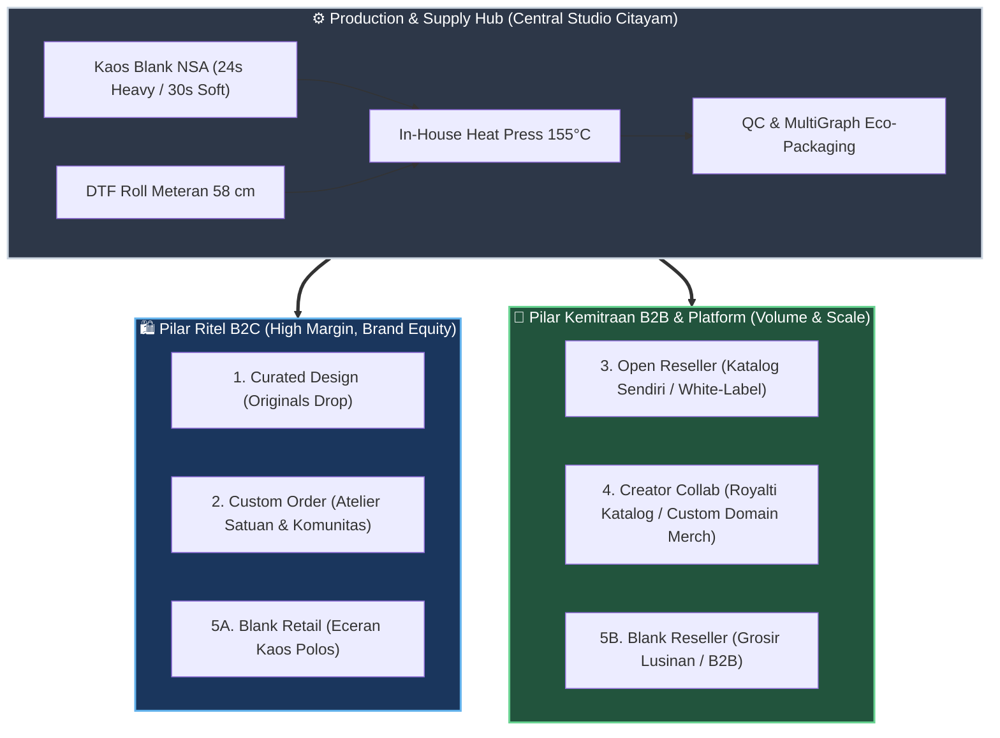
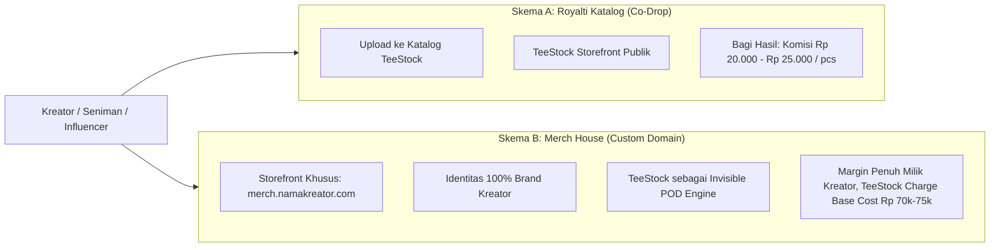
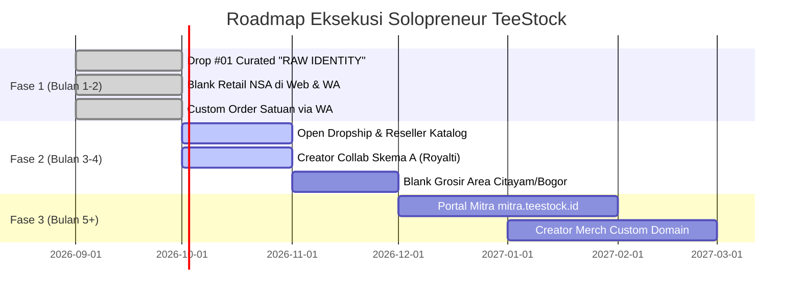

# 📐 Breakdown Komprehensif 5 Pilar Model Bisnis TeeStock

> [!abstract] Ringkasan Eksekutif
> TeeStock berevolusi dari sekadar toko kaos ritel online menjadi **Hybrid Apparel & Merch House Infrastructure**. Model bisnis ini memadukan **Brand D2C Berkualitas Tinggi** (menjaga *perceived value* & margin) dengan **Fasilitas Produksi On-Demand In-House** (menghidupkan kemitraan reseller, kreator, dan pesanan kustom tanpa risiko dead-stock).
> 
> Dokumen ini membedah 5 pilar bisnis dari kacamata 5 peran C-Suite: **Mentor Bisnis** (strategi), **COO** (operasional solo founder), **CFO** (unit economics & cash flow), **CTO** (kebutuhan teknologi & sistem), dan **CMO** (akuisisi & positioning).

---

## 🗺️ Peta Arsitektur Ekosistem 5 Pilar

---

## 1. Curated Design Graphic (TeeStock Originals)

> **Fokus:** Brand D2C, Kurasi Grafis Tematik, The Drop Model (Koleksi Berkala).

* **Target Pasar:** Anak muda urban, gen Z, pekerja kreatif/tech, komunitas streetwear niche yang mencari desain orisinal, estetik, dan tidak pasaran di marketplace.
* **Value Proposition:** Desain grafis berkarakter (*art-driven*), kain New States Apparel (NSA) Heavyweight 24s tubular knit (tanpa jahitan samping, kerah 2.2 cm kokoh), sablon DTF double-press halus & tahan cuci.
* **Alur Operasional (COO):**
  1. Founder merilis 3–4 desain terkurasi dalam 1 tema payung (contoh: Drop #01 *"RAW IDENTITY"*).
  2. Cetak film DTF roll meteran gang sheet sesuai proyeksi batch (scarcity model: 24–48 pcs).
  3. Proses press in-house 155°C, QC, dan packaging polymailer doff + stiker bonus via [[bisnis/multigraph/README|MultiGraph]].
  4. Pengiriman H+0 atau H+1.
* **Unit Economics & Margin (CFO):**
  - **HPP Kaos 24s Jadi:** Rp 49.000 – Rp 53.500 (Kaos Rp 38k + DTF A3 Rp 12,5k + Listrik & Pack Rp 3k).
  - **Anchor Price (Harga Coret):** Rp 139.000
  - **Harga Jual Ritel:** **Rp 99.000 – Rp 109.000**
  - **Gross Margin:** **~51%** (Laba kotor: Rp 45.500 – Rp 55.500 / pcs).
* **Kebutuhan Teknologi (CTO):**
  - Web storefront `teestock.vercel.app` (Sudah Live 100%).
  - Modul katalog, checkout Midtrans/QRIS, dan notifikasi WhatsApp order.
* **Analisis Beban Kerja Solopreneur:** **Rendah – Sedang**. Desain sudah disiapkan di awal secara *batching*, layout DTF seragam, proses press repetitif dan cepat (20 detik per kaos).

---

## 2. Custom Order (TeeStock Atelier)

> **Fokus:** Print-on-Demand Satuan & Pesanan Komunitas (No Minimum Order).

* **Target Pasar:**
  1. *Satuan (B2C):* Pembeli perorangan yang ingin kaos foto/tulisan sendiri, hadiah ulang tahun, kaos event keluarga/couple.
  2. *Komunitas / UMKM (Micro-B2B):* Kaos angkatan, klub motor/lari, seragam barista cafe (5–24 pcs).
* **Value Proposition:** Bisa pesan mulai 1 pcs tanpa minimum order, garmen standar ekspor NSA, hasil cetak tajam 300 DPI, proses cepat 1–2 hari kerja tanpa harus menunggu mingguan seperti sablon manual.
* **Alur Operasional (COO):**
  1. Calon pembeli mengisi form di `/custom-order` (upload file desain, pilih jenis kaos, ukuran & posisi cetak).
  2. Form otomatis merangkum data dan me-redirect ke WhatsApp Admin dengan estimasi harga.
  3. Pre-flight file desain (cek resolusi & transparansi PNG).
  4. Selipkan desain ke slot kosong gang sheet DTF harian.
  5. Press & kirim.
* **Unit Economics & Margin (CFO):**
  - **HPP Kaos Satuan:** Rp 49.000 – Rp 55.000
  - **Harga Jual Satuan:** **Rp 119.000 – Rp 139.000** (atau model add-on: Harga Kaos Polos + Jasa Sablon Rp 25.000 – Rp 40.000).
  - **Gross Margin:** **~58% – 64%** (Laba kotor: Rp 65.000 – Rp 85.000 / pcs).
  - **Order Komunitas (12–24 pcs):** Diberikan harga tiering Rp 85.000 – Rp 95.000 (Margin tetap aman di 35–42%).
* **Kebutuhan Teknologi (CTO):**
  - Form spesifikasi kustom di website (sudah aktif di `/custom-order`).
  - *Next Upgrade:* File uploader langsung ke Cloudinary + visual preview kaos interaktif.
* **Analisis Beban Kerja Solopreneur:** **Sedang – Tinggi**. Waktu sering terkuras di komunikasi chat WhatsApp ("kak desain saya pecah gak?") dan perbaikan file konsumen.
  > [!warning] COO Guardrail
  > Terapkan SOP ketat: Format wajib PNG transparan 300 DPI. Jika konsumen minta edit/buang background rumit, kenakan **Biaya Setting Desain Rp 15.000 – Rp 25.000** agar waktu Anda tidak tersita gratis.

---

## 3. Open Reseller & Dropshipper

> **Fokus:** Pasukan Penjualan Lepas (Leverage Traffic Orang Lain).

Model ini terbagi menjadi **2 Sub-Jalur**:

### 3A. Reseller Katalog TeeStock (Jual Desain Curated)
* **Target:** Reseller dropship, mahasiswa, content creator afiliasi yang ingin jualan distro tanpa modal stok.
* **Alur Kerja:** Reseller mempromosikan desain TeeStock di akun medsos/Shopee mereka. Begitu ada pesanan, reseller order ke TeeStock dengan harga khusus, TeeStock memproduksi dan mengirimkan paket secara *white-label* (nama pengirim: toko si reseller).
* **Struktur Harga:**
  - **Harga Ritel Standar:** Rp 99.000
  - **Harga Modal Reseller Satuan (Dropship):** **Rp 75.000**
  - **Profit Reseller:** Rp 24.000 / pcs
  - **Laba Bersih TeeStock:** ~Rp 21.500 / pcs (Margin 28.6%).
  - **Tier Grosir (Min 12 pcs stok sendiri):** **Rp 65.000** (Laba TeeStock: ~Rp 13.500 / pcs, perputaran kas instan).

### 3B. Reseller Desain Sendiri (POD White-Label B2B)
* **Target:** Pemilik brand distro pemula, seniman indie, atau reseller yang sudah punya pasar sendiri tapi tidak punya mesin press dan enggan repot urus produksi.
* **Alur Kerja:** Reseller mengirim master desain mereka -> TeeStock cetak di kaos NSA -> label pengiriman thermal A6 dicetak atas nama brand mereka -> kirim langsung ke customer akhir.
* **Struktur Harga:**
  - **Harga Cetak Satuan Dropship:** **Rp 75.000 – Rp 80.000** (Kaos NSA + DTF A3).
  - **Laba Bersih TeeStock:** Rp 21.000 – Rp 26.000 / pcs.
* **Analisis Beban Kerja Solopreneur:**
  - *Jalur 3A:* **Sangat Ringan** (file sudah matang).
  - *Jalur 3B:* **Sedang** (butuh sistem antrean rapi di Admin Kanban agar desain antar-brand tidak tertukar).
* **Kebutuhan Teknologi (CTO):**
  - Toggle generator label pengiriman thermal A6 white-label di Admin HUB (sudah tersedia).
  - Portal kemitraan terisolasi di `mitra.teestock.id` agar tidak merusak harga ritel Rp 99k di etalase publik.

---

## 4. Kolaborasi Kreator (Creator Merch House Platform)

> **Fokus:** Monetisasi Komunitas Kreator (Komik, Musisi, Ilustrator, Podcaster, Streamer).

Pilar ini adalah **game-changer** untuk skalabilitas jangka panjang. Dibagi menjadi **2 Skema Kolaborasi**:

### 4A. Skema A: Co-Drop Katalog (Royalti per Pcs Terjual)
* **Mekanisme:**
  1. Ilustrator/kreator mengirimkan artwork eksklusif.
  2. TeeStock memasukkan desain tersebut ke katalog publik dengan label *"TeeStock X [Nama Kreator]"*.
  3. Dijual dengan harga ritel premium: **Rp 109.000 – Rp 129.000**.
  4. Setiap kaos terjual, kreator mendapatkan **Royalti Rp 20.000 – Rp 25.000 / pcs**, ditransfer berkala (tiap tanggal 1 atau 15).
  5. Kreator wajib ikut mempromosikan link produk ke follower mereka.
* **Unit Economics (Contoh Jual Rp 119.000):**
  - HPP Kaos NSA 24s + DTF A3: Rp 53.500
  - Komisi Kreator: Rp 25.000
  - Laba Bersih TeeStock: **Rp 40.500** (Margin Bersih 34%).
* **Kelebihan:** Zero risk bagi kreator, TeeStock mendapat exposure audiens baru secara gratis (*piggyback marketing*).

### 4B. Skema B: Merch House dengan Custom Domain / Subdomain
* **Mekanisme:**
  1. Kreator memiliki basis fans yang besar dan ingin brand-nya eksklusif (misal: `merch.budiilustrator.com` atau `budi.teestock.id`).
  2. TeeStock menyediakan *white-label storefront* instan.
  3. Kreator bebas menentukan harga jual sendiri (misal Rp 149.000).
  4. TeeStock mengenakan **Base Fulfillment Cost Flat**: misal **Rp 75.000 / pcs** (Kaos NSA 24s + DTF + Packaging + Biaya Tenaga Press).
  5. Selisih harga jual dikurangi base cost (Rp 149.000 - Rp 75.000 = Rp 74.000) masuk ke rekening kreator setelah dipotong fee gateway.
* **Kebutuhan Teknologi (CTO):**
  - Ini adalah fitur *software-as-a-service* (SaaS-lite) mirip Fourthwall atau Printify.
  - Membutuhkan arsitektur multi-tenant, custom domain mapping di Vercel/Cloudflare, dan dashboard saldo kreator.
* **Analisis Beban Kerja Solopreneur:**
  - *Skema A:* **Ringan**. Sangat cocok dieksekusi sekarang (Fase 1–2).
  - *Skema B:* **Sangat Berat** jika dipaksakan sekarang. Membutuhkan otomasi payout dan maintenance server.
  > [!tip] Rekomendasi Mentor Bisnis
  > Mulai dari **Skema A** terlebih dahulu dengan 2–3 micro-creator (followers 5k–20k di niche ilustrasi/game). Jangan bangun infrastruktur custom domain sebelum ada bukti bahwa kreator tersebut konsisten menjual minimal 30–50 pcs per bulan!

---

## 5. Blank Reseller & Retail (Official NSA Blanks)

> **Fokus:** Cashflow Cepat, Buffer Margin, Solusi Kebutuhan Kaos Polos.

Pilar ini memanfaatkan status TeeStock yang memiliki akses suplai New States Apparel (NSA) resmi dari distributor Cititex.

### 5A. Blank Retail (Eceran Kaos Polos Satuan)
* **Target:** Konsumen pencinta kaos polos *basic streetwear*, orang yang mencari alternatif Uniqlo Supima / U-Crew dengan harga 1/3-nya, atau hobiis.
* **Model Penjualan:** Dijual langsung di etalase web (`/` & filter `Blanks`) atau marketplace Shopee/TikTok.
* **Unit Economics (CFO):**
  - **HPP NSA 3600 (30s):** Rp 33.000 + Pack Rp 2.000 = Rp 35.000 $\rightarrow$ Jual **Rp 49.000** (Margin 28.5%).
  - **HPP NSA 7200 (24s):** Rp 38.000 + Pack Rp 2.000 = Rp 40.000 $\rightarrow$ Jual **Rp 59.000** (Margin 32.2%).
* **Fungsi Strategis:** Menjadi **produk pancingan (lead magnet)** dan pembuka pintu upsell: *"Tambah Rp 25.000 untuk cetak desain custom Anda sendiri!"*

### 5B. Blank Reseller / Grosir Lusinan (B2B Volume)
* **Target:** Brand distro lokal pemula, vendor sablon manual/DTG kecil di Depok/Bogor/Citayam yang butuh suplai cepat tanpa harus jauh-jauh belanja ke pusat grosir Jakarta.
* **Model Penjualan:** Penjualan minimal 1 lusin (12 pcs) atau 1 karton (72 pcs).
* **Unit Economics (CFO):**
  - Margin per kaos tipis: **Rp 3.000 – Rp 6.000 / pcs**.
  - Tapi keuntungan didapat dari **perputaran volume uang (cash velocity)** dan **akumulasi diskon tier distributor** dari Cititex.
  - *Contoh:* Jual 5 lusin (60 pcs) x margin Rp 4.000 = Laba bersih Rp 240.000 dengan modal kerja berputar dalam hitungan jam tanpa perlu menyentuh mesin press.
* **Analisis Beban Kerja Solopreneur:** **Nol Proses Produksi** (Hanya packing dan kirim/pickup).

---

## 📊 Matriks Komparasi C-Suite 5 Pilar Bisnis

| Pilar Bisnis | Tipe Transaksi | Gross Margin | Cash Velocity | Beban Kerja Solo Founder | Skalabilitas | Kesiapan Eksekusi |
|---|---|---|---|---|---|---|
| **1. Curated Originals** | B2C D2C | **50% – 52%** | Sedang (Tergantung hype/iklan) | Sedang | ⭐⭐⭐⭐ | 🟢 **Ready Now** (Web Live) |
| **2. Custom Atelier** | B2C / Micro-B2B | **55% – 64%** | Cepat (DP / Cash di depan) | Tinggi (Komunikasi chat) | ⭐⭐⭐ | 🟢 **Ready Now** (Form WA) |
| **3. Open Reseller** | B2B Dropship | **28% – 32%** | Cepat (Volume per reseller) | Rendah (White-label) | ⭐⭐⭐⭐⭐ | 🟡 **Fase 2** (Portal Mitra) |
| **4A. Creator Royalti** | B2C Collab | **34% – 40%** | Sangat Cepat (Fans kreator) | Rendah | ⭐⭐⭐⭐⭐ | 🟢 **Ready Now** (Manual Collab) |
| **4B. Creator Domain** | Platform SaaS | **Flat Fee (Rp 20k/pcs)** | Bergantung Kreator | Sangat Tinggi (Tech infra) | ⭐⭐⭐⭐⭐ | 🔴 **Fase 3** (Butuh Dev Web) |
| **5A. Blank Retail** | B2C Eceran | **28% – 32%** | Cepat (Kebutuhan rutin) | Sangat Rendah | ⭐⭐⭐ | 🟢 **Ready Now** (Web Live) |
| **5B. Blank Reseller** | B2B Grosir | **8% – 12%** | Sangat Cepat (Cash di depan) | Nol (No heat press) | ⭐⭐⭐⭐ | 🟡 **Fase 2** (Depok/Bogor Area) |

---

## 🧭 Rekomendasi Pentahapan Roadmap (Mentor Bisnis)

Sebagai solopreneur dengan sumber daya 1 orang, **jangan jalankan semuanya secara bersamaan di hari pertama**. Anda akan terjebak dalam *operational chaos* (melayani chat custom, komplain reseller, dan revisi desain kreator sekaligus).

Gunakan strategi 3 fase terukur:

### Langkah Konkret Minggu Ini:
1. **Kunci 3 Pilar Utama Dulu:** Jalankan *Drop #01 Curated*, *Blank Retail*, dan *Custom Satuan via WA*. Ini membuktikan mesin press dan alur DTF berjalan mulus tanpa cacat.
2. **Dekati 1 Kreator Pertama (Skema A):** Ajak 1 ilustrator teman/kenalan di Instagram/X dengan audiens 2k–10k. Tawarkan kolaborasi: *"Gue yang modalin kaos NSA + sablon + packing + kirim, lo dapet Rp 25.000 bersih per kaos terjual dari fans lo."*
3. **Validasi Reseller Organik:** Biarkan reseller pertama datang secara organik dari pembeli ritel yang puas, lalu masukkan mereka ke grup WhatsApp khusus VIP Reseller sebelum membangun web portal otomatis yang rumit.
