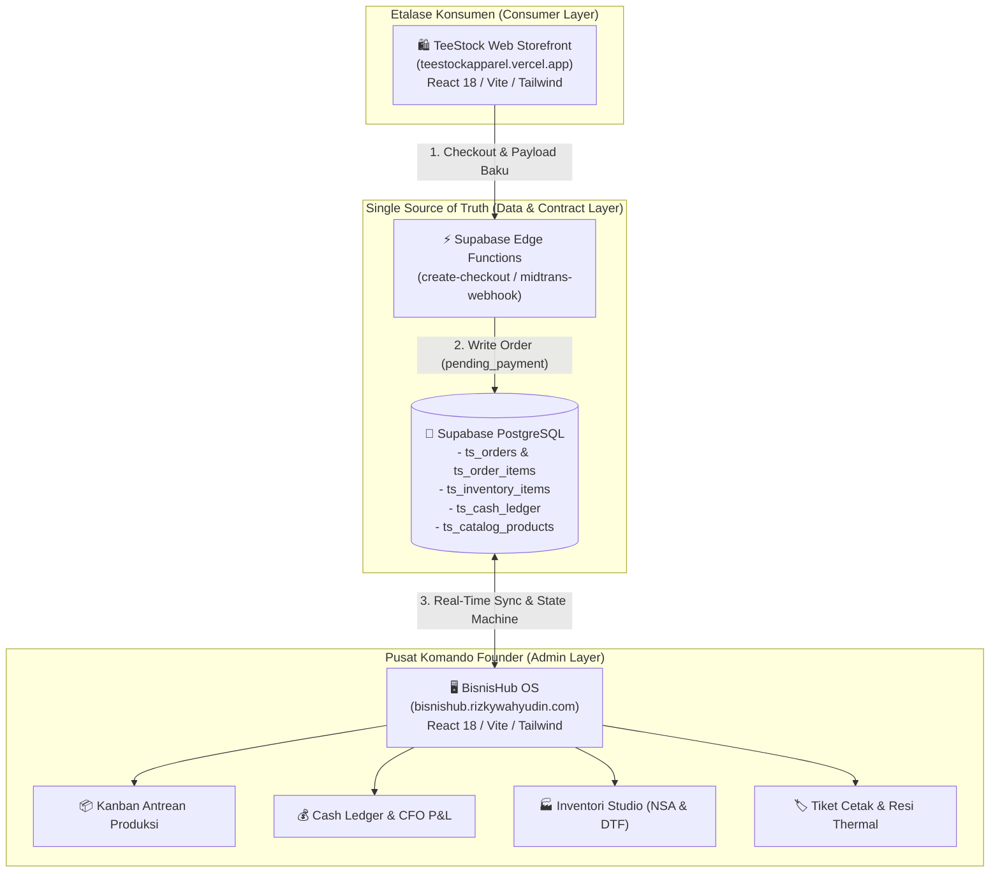
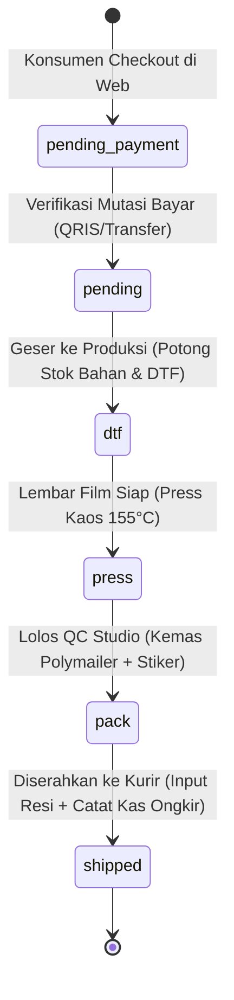

# 🏛️ Arsitektur Ekosistem & Matriks Integrasi Fitur BisnisHub — TeeStock

> [!abstract] Visi Arsitektur Ekosistem
> Menghubungkan etalase konsumen (**TeeStock Web Storefront**) dengan pusat komando operasional solo founder (**BisnisHub OS**) ke dalam satu **Single Source of Truth (SSOT)**. Mencegah pengembangan fitur terisolasi (*silo development*), menjamin konsistensi data finansial, mengisolasi dana titipan ongkir kurir, dan menjaga keandalan antrean produksi.

---

## 1. Peta Topologi Ekosistem (High-Level Topology)

---

## 2. Kontrak Data Baku Pesanan (Order Data Contract)

Untuk mencegah konflik nama properti atau hilangnya data saat transaksi berpindah dari etalase ke antrean produksi, setiap payload pesanan **wajib memenuhi kontrak berikut**:

| Properti | Tipe | Sumber | Deskripsi & Aturan Bisnis |
|---|---|---|---|
| `order_number` / `id` | `String` | Sistem | Kode unik pesanan (misal `TS-2609-1234`). |
| `subtotal` | `Number` | Webclient | Nilai bruto belanja produk (sebelum kupon & ongkir). |
| `discount_amount` | `Number` | Webclient | Total potongan kupon voucher & bundling grosir. |
| `shipping_fee` | `Number` | Webclient | Tarif riil ongkir kurir (J&T, SiCepat, JNE). **Pass-through.** |
| `unique_code` | `Number` | Webclient | Kode unik 3 digit verifikasi manual transfer/QRIS (100-899). |
| `total_amount` | `Number` | Webclient | Total tagihan = `subtotal - discount_amount + shipping_fee + unique_code`. |
| `status` | `Enum` | State Machine | Status alur: `pending_payment` &rarr; `pending` &rarr; `dtf` &rarr; `press` &rarr; `pack` &rarr; `shipped`. |
| `items` | `Array` | Webclient | Rincian garmen, ukuran, warna, qty, SKU desain, dan harga satuan. |
| `fulfillment_origin` | `String` | Webclient | Sentra pemenuhan: `Studio Depok` vs `Hub Bogor Express`. |

---

## 3. Aturan Isolasi Finansial CFO (Courier Shipping Isolation)

> [!important] CFO Financial Guardrail: Nol Margin pada Ongkos Kirim
> Ongkos kirim kurir adalah **liabilitas/dana titipan pembeli yang akan disetorkan 100% ke kurir ekspedisi**.
> Dilarang keras menganggap ongkir kurir sebagai pendapatan penjualan produk atau laba bersih!

### Formula Baku Akuntansi BisnisHub:

1. **Omset Penjualan Bersih Produk (Net Product Revenue)**:
   $$\text{Product Revenue} = \text{subtotal} - \text{discount\_amount}$$
2. **Laba Bersih Transaksi (Net Profit)**:
   $$\text{Net Profit} = \text{Product Revenue} - \text{Platform Fee} - \text{Total HPP (BOM)}$$
   *(Dimana HPP = Kaos Polos NSA + Sablon DTF + Kemasan MultiGraph + Buffer Defect 5%)*.
3. **Persentase Margin Realistis (Realized Margin %)**:
   $$\text{Realized Margin \%} = \left( \frac{\text{Net Profit}}{\text{Product Revenue}} \right) \times 100$$
4. **Beban Pengiriman Ekspedisi (Courier Expense)**:
   Saat status pesanan bergeser ke `shipped`, sistem mencatat pengeluaran kas sebesar `shipping_fee` dengan kategori `courier_shipping` (Net Cash Flow dari ongkir = Rp 0).

---

## 4. State Machine Siklus Hidup Pesanan (Order Lifecycle)

### Rincian Pemicu & Dampak Terikat:

| Tahap Status | Pemicu (Trigger) | Dampak Otomatis di BisnisHub OS | Dampak Finansial & Inventori |
|---|---|---|---|
| `pending_payment` | Konsumen klik "Bayar Sekarang" | Masuk Kolom 1 Kanban, badge oranye "Menunggu Verifikasi" | Belum memotong stok bahan, belum mencatat omset kas |
| `pending` &rarr; `dtf` / `press` | Founder verifikasi mutasi rekening | Masuk Kolom 2 ("Antrean DTF") atau Kolom 3 ("Heat Press") | 1. Stok fisik Kaos NSA & Film DTF terpotong otomatis 2. Kas Masuk (`sales_retail`) dibukukan ke Ledger |
| `press` &rarr; `pack` | Selesai sablon 155°C, cold peel, teflon | Masuk Kolom 4 ("QC & Kemas") | Siap cetak Slip Kerja & Label Thermal 100x150 mm |
| `pack` &rarr; `shipped` | Diserahkan ke drop point kurir | Masuk Kolom 5 ("Selesai / Terkirim") | 1. Input resi kurir & tombol link WA pelanggan aktif 2. Kas Keluar (`courier_shipping`) otomatis dibukukan |

---

## 5. Checklist 4 Pilar Integrasi Fitur Baru (Anti-Silo Pre-Commit)

Sebelum fitur baru diimplementasikan atau dirilis ke produksi, tim engineer wajib memvalidasi checklist berikut:

- [ ] **Pilar 1: Database & RLS (SSOT)**
  - Apakah struktur tabel dan RLS di Supabase sudah mendukung integrasi dua arah (`teestock-web` & `bisnishub-web`)?
  - Apakah migrasi SQL terdokumentasi di folder `database/`?
- [ ] **Pilar 2: Integritas Finansial (CFO)**
  - Apakah fitur ini mematuhi batas margin minimum $\ge 35\%$?
  - Apakah seluruh komponen ongkir, fee gateway, dan diskon telah diisolasi sesuai formula baku?
- [ ] **Pilar 3: Alur Operasional (COO)**
  - Apakah fitur ini memengaruhi antrean Kanban, pemotongan stok bahan, atau kalkulasi gang sheet DTF?
  - Apakah memiliki pengecekan idempotency untuk mencegah double-deduction?
- [ ] **Pilar 4: Pengalaman Pengguna (CMO/UI)**
  - Apakah antarmuka diuji pada layar smartphone mobile-first (360px - 430px)?
  - Apakah tombol aksi memiliki touch target minimal 44x44px?

---

## 🔗 Rujukan Terkait
- [[🏠 BisnisHub Command Center|BisnisHub Command Center Dashboard]]
- [[bisnis/teestock/README|Dokumentasi Utama TeeStock]]
- [[apps/bisnishub-web/README|Panduan BisnisHub Web OS]]
- [[catatan/piagam-co-founders-bisnishub|Piagam Co-Founders BisnisHub]]
- [[bisnis/teestock/keuangan/kesepakatan-skema-harga-teestock|Piagam Kesepakatan Skema Harga & Margin]]
- [[bisnis/teestock/operasional/sop-penyimpanan-film-dtf-dan-posisi-press|SOP Penyimpanan Film DTF & Posisi Press]]
