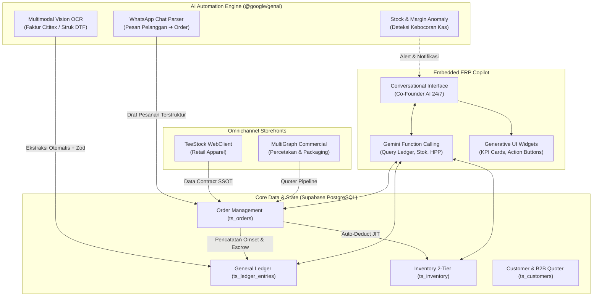

# 🌐 Blueprint ERP Bisnis Terintegrasi & AI Automation — BisnisHub OS

> [!abstract] Visi Strategis
> Dokumen ini adalah cetak biru teknis dan operasional untuk mentransformasikan **BisnisHub OS** menjadi **Integrated Autonomous Business ERP** — sistem operasi bisnis cerdas yang menghubungkan seluruh pilar ekosistem percetakan & apparel (MultiGraph, TeeStock, Packaging) dengan otomatisasi AI mutakhir berbasis **Google Gemini 3.8 Flash**.

---

## 1. Arsitektur Hub & Spoke Terintegrasi

---

## 2. Peta Subagent & Skill Set Khusus

Untuk mengembangkan dan merawat sistem ini secara mandiri dan terkoordinasi, workspace dilengkapi dengan 3 pilar agen baru:

| Subagent | Skill Terkait | Fokus Utama |
|---|---|---|
| `erp-architect` | `integrated-erp-engine` | Rekayasa modul ERP (Multi-Unit GL, 2-Tier Stock, BOM HPP, Kanban Produksi, B2B Quoter). |
| `ai-automation-engineer` | `ai-automation-engine` | Otomasi proses cerdas (Gemini Vision OCR struk belanja, WA order parser, Supabase Edge Functions, idempotency). |
| `ai-copilot-builder` | `ai-copilot-builder` | Asisten eksekutif tersemat di dashboard (Gemini Tool Calling, Chat-with-Data, Generative UI, Morning Brief). |

---

## 3. Rencana Rilis Fitur ERP & AI (Sprint Roadmap)

### Fase 1: ERP Foundation & Anti-Silo Hardening (Sprint Berjalan)
- [x] Shared package `@bisnishub/shared` di `packages/shared/src/` (36 file SSOT).
- [x] Version parity: `react-router-dom` v7.18.4 di kedua aplikasi web.
- [x] Isolasi ketat dana titipan ongkir kurir (`shipping_fee`) dari laba dan omset produk.
- [ ] Penggabungan form PO procurement langsung ke pencatatan kas keluar `ts_ledger_entries`.

### Fase 2: AI Automation Pipeline
- [ ] **Modul 1: Scan Struk & Faktur Belanja (OCR)**:
  - Upload foto nota Cititex atau supplier film DTF di BisnisHub OS.
  - Gemini 3.8 Flash mengekstrak nama item, jumlah kaos, harga satuan, dan tanggal ke draf mutasi kas.
  - Human-in-the-Loop konfirmasi 1-klik untuk approval pencatatan saldo.
- [ ] **Modul 2: WhatsApp Chat Order Parser**:
  - Webhook chat masuk di-parse menjadi draf pesanan resmi (alamat pengiriman, model kaos NSA, ukuran, jumlah, dan preferensi pembayaran).

### Fase 3: Embedded AI Copilot & Generative UI
- [ ] **Asisten Bisnis C-Suite Tersemat**:
  - Tombol Copilot mengambang di pojok kanan bawah BisnisHub OS.
  - Dukungan interogasi natural language: *"Berapa sisa runway kas Teestock dan ada berapa pesanan pending hari ini?"*
  - Tool calling terisolasi ke database Supabase via service shared.
- [ ] **Executive Morning Brief Otomatis**:
  - Ringkasan harian pukul 07.30 WIB mencakup status likuiditas, antrean press DTF, dan stok menipis.

---

## 4. Guardrail Integritas Data & Keuangan

> [!important] Aturan Mutlak Eksekusi AI
> 1. **Auditability**: Semua entitas database yang dibuat/diedit oleh AI wajib memiliki tanda `created_by: 'ai_automation'` lengkap dengan metadata model dan confidence score.
> 2. **Plafon Approval Kas**: Mutasi kas keluar $> \text{Rp 500.000}$ atau pemotongan inventori $> 10\text{ pcs}$ wajib menunggu konfirmasi founder (tidak boleh auto-commit tanpa review).
> 3. **Idempotency Hash**: Berkas nota/struk yang sama dilarang diproses dua kali (dicek via SHA-256 hash).
