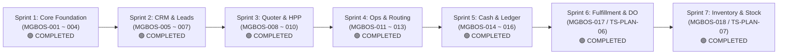

# 🗺️ MultiGraph Business OS (MGBOS) — Master Roadmap & Execution Tracker

> [!abstract] **Visi Eksekutif**
> Dokumen ini adalah **pusat pelacakan resmi** evolusi dan eksekusi bertahap **MultiGraph Business OS (MGBOS)**. Mengonsolidasikan seluruh cetak biru (*blueprint series*) yang dirumuskan oleh Founder bersama Founding C-Suite Cabinet ke dalam sprint-sprint kecil terukur (30–60 menit) dengan kepatuhan penuh pada **Rule of Vertical Slices** dan **Dual-Track Execution**.

---

## 📚 Indeks Pustaka Blueprint MGBOS (Arsip Sesi Founder)

Seluruh spesifikasi arsitektur bisnis dan rekayasa perangkat lunak MGBOS terdokumentasi lengkap di folder `catatan/sesi/`:

| Versi | Judul Dokumen | Fokus & Isi Kunci |
|---|---|---|
| **0.1** | [[catatan/sesi/2026-09-23 - MultiGraph Business OS v1 - Blueprint Draft 0.1\|Blueprint Draft 0.1]] | North Star, Holding 5 Brand, 9 Domain, Vendor Network, Authority Model |
| **0.2** | [[catatan/sesi/2026-09-23 - MGBOS 0.2 - Canonical Data Model v0.1\|Canonical Data Model 0.2]] | Database mewakili realitas bisnis, Global Context, Cost Trilogy, Snapshots |
| **0.2.1** | [[catatan/sesi/2026-09-23 - MGBOS 0.2.1 Logical Data Model\|Logical Data Model 0.2.1]] | DDL Postgres, Bigint Rupiah, Batasan JSONB, ERD Relasional & Indexing |
| **0.3** | [[catatan/sesi/2026-09-23 - MGBOS 0.3 — Business State Machines\|Business State Machines 0.3]] | Siklus hidup terisolasi (Sales, Ops, Finance), Transition Guards, Derived States |
| **0.4** | [[catatan/sesi/2026-09-23 - MGBOS 0.4 — System Architecture v0.1\|System Architecture 0.4]] | Modular Monolith, CQRS mindset, Transactional Outbox Pattern, n8n Orchestrator |
| **0.5** | [[catatan/sesi/2026-09-23 - MGBOS 0.5 — TeeStock Pilot MVP\|TeeStock Pilot MVP 0.5]] | Lingkup MVP Custom Atelier, Command Center v0, Pricing Guards, Dual-Running |
| **0.5.1** | [[catatan/sesi/2026-09-23 - MGBOS 0.5.1\|Custom Atelier Product Spec 0.5.1]] | Spesifikasi layar lengkap: Home, Leads, CRM 360, Requirement Builder, Quotes |
| **0.5.2** | [[catatan/sesi/2026-09-23 - MGBOS 0.5.2\|Implementation Backlog & Build Plan 0.5.2]] | Aturan Vertical Slices, Backlog paket kerja MGBOS-001 s.d. MGBOS-016 |
| **0.5.3** | [[catatan/sesi/2026-09-23 - MGBOS 0.5.3\|Engineering Spec & Repository Standard 0.5.3]] | Konstitusi teknis: Strict TypeScript, Node 20 LTS, Testing, Boundary Integrity |
| **0.5.4** | [[catatan/sesi/2026-09-23 - MGBOS 0.5.4\|Repository Bootstrap Spec 0.5.4]] | Spesifikasi Bootstrap Sprint 1 (Repo Foundation, Org Schema, DocNumber Service) |

---

## 🚦 Status Pelaksanaan Sprint Backlog



---

### 🟢 Sprint 1: Core Foundation & Clean App Bootstrap (Rilis 23 Sep 2026)
*Target: Aplikasi bersih `apps/mgbos`, skema database holding multi-brand, dan service penomoran dokumen.*

- [x] **MGBOS-001**: Clean App Scaffolding `apps/mgbos` (React 18 + Strict TypeScript + Vite 6 + Tailwind CSS) di Port **3001**.
- [x] **MGBOS-002**: Database Migration Holding Multi-Brand ([`20260923_mgbos_foundation.sql`](file:///c:/Users/Rizky/bisnishub/supabase/migrations/20260923_mgbos_foundation.sql)) — Tabel `organizations`, `brands`, `business_lines`, `channels` beserta seed data resmi MultiGraph Group.
- [x] **MGBOS-003**: System Context & Brand Switcher Helper ([`systemContext.ts`](file:///c:/Users/Rizky/bisnishub/packages/shared/src/domain/context/systemContext.ts)) untuk penandaan transaksi multi-brand.
- [x] **MGBOS-004**: Deterministic Document Number Service ([`documentNumberService.ts`](file:///c:/Users/Rizky/bisnishub/packages/shared/src/domain/common/documentNumberService.ts)) — Generator & validator nomor dokumen resmi (`TS-ORD-2026-0001`, `MG-QUO-2026-0042`, dll.) dengan 100% Vitest pass.
- [x] **MGBOS Shell & Command Center v0**: Layout sidebar hierarki MGBOS 0.5.1, Active Brand Selector dinamis, dan dashboard Founder Command Center v0 ([`HomePage.tsx`](file:///c:/Users/Rizky/bisnishub/apps/mgbos/src/pages/HomePage.tsx)).

---

### 🟢 Sprint 2: Customer 360 & Inbound Leads Pipeline (Certified Complete)
*Target: Database pelanggan holding lintas brand dan penanganan inquiry masuk calon pembeli.*

- [x] **MGBOS-005**: Customer Account & Contact Domain Model (Customer 360)
  - Tabel `customer_accounts` (Individual vs Corporate).
  - Tabel `customer_contacts`, `customer_brand_relationships`, `addresses`, `customer_addresses`.
  - Halaman `Customer 360` di MGBOS Shell dengan filter per brand context dan modal tambah customer.
  - Laporan eksekusi: `mgbos/docs/engineering/mgbos-005-report.md`.
- [x] **MGBOS-006**: Inbound Lead Pipeline & Qualification Engine
  - Tabel `leads` dengan status lifecycle: `NEW` $\rightarrow$ `CONTACTED` $\rightarrow$ `QUALIFYING` $\rightarrow$ `QUALIFIED` $\rightarrow$ `CONVERTED` (dan `DISQUALIFIED`, `LOST`).
  - Automatic canonical document numbering (`TS-L-2026-000001`) via trigger `app.trg_leads_generate_number`.
  - Qualification engine rules v1 (kontak valid, kebutuhan pesanan teridentifikasi, kuantiti estimasi valid).
  - Halaman `Leads & Inquiries` dengan drawer/modal detail, 1-click qualify/disqualify/convert ke customer.
  - Laporan eksekusi: `mgbos/docs/engineering/mgbos-006-report.md`.
- [x] **MGBOS-007**: Requirement Aggregate & Versioning Engine
  - Tabel `requirements` & `requirement_versions` (immutable snapshots) untuk mencatat spesifikasi kebutuhan cetak/garmen kustom.
  - State machine requirement: `DRAFT` $\rightarrow$ `NEEDS_INFORMATION` $\rightarrow$ `READY` $\rightarrow$ `LOCKED` (dan `CANCELLED`).
  - Trigger immutability database untuk versi terkunci.
  - Laporan eksekusi: `mgbos/docs/engineering/mgbos-007-report.md`.

---

### 🟢 Sprint 3: Requirement Builder & Quote Versioning (Certified Complete)
*Target: Form spesifikasi garmen Custom Atelier v1 dan kalkulator penawaran berversi dengan CFO Pricing Floor.*

- [x] **MGBOS-008**: Custom Atelier Requirement Schema (`teestock.custom_atelier.v1`)
  - Form interaktif di storefront & dashboard: Garment type, fit, combed 24s/30s, size breakdown (S-XXL), posisi sablon DTF/screen.
  - Validasi schema Zod & database trigger JSON schema check.
  - Laporan eksekusi: `mgbos/docs/engineering/mgbos-008-report.md`.
- [x] **MGBOS-009**: Quote Versioning & Pricing Floor Guard Engine
  - Kalkulator HPP internal vs harga jual penawaran dengan bigint rupiah murni (Zero-Float).
  - CFO Hard Guard: Kunci batas margin lantai (Warning di bawah 25%, Block di bawah 20% tanpa approval).
  - Isolasi ongkir pelanggan sebagai dana pass-through escrow.
  - Laporan eksekusi: `mgbos/docs/engineering/mgbos-009-report.md`.
- [x] **MGBOS-010**: Official Quotation Generator & Customer Projection Allowlist
  - Pembuatan ringkasan quotation profesional (format PDF via `pdf-lib` & tampilan detail) dengan nomor dokumen kanonikal `TS-Q-YYYY-XXXXXX`.
  - Strict projection allowlist: pencegahan kebocoran HPP modal internal, supplier, dan catatan internal ke customer PDF.
  - Laporan eksekusi: `mgbos/docs/engineering/mgbos-010-report.md`.

---

### 🟢 Sprint 4: Order Contract Snapshot, Production Routing & QC (Certified Complete)
*Target: Pembekuan kontrak pesanan, pemecahan job multi-vendor, direktori vendor & rate cards, dan log inspeksi QC.*

- [x] **MGBOS-011**: Order Contract Snapshot & Address Freezing
  - Konversi Quote $\rightarrow$ Order Snapshot immutable (`app.orders` dan `app.order_items`).
  - Alur persetujuan penawaran resmi (`app.mark_quote_accepted` via WhatsApp/Email/Signature).
  - Pembekuan alamat pengiriman permanen (Address Freezing) dan spesifikasi garmen.
  - Penomoran kanonikal pesanan `{BRAND}-O-{YEAR}-{SEQUENCE}` (e.g. `TS-O-2026-000001`).
  - Laporan eksekusi: `mgbos/docs/engineering/mgbos-011-report.md`.
- [x] **MGBOS-012**: Production Job Splitting (`order_items` M:N `production_jobs`)
  - Pemecahan 1 pesanan menjadi Job Bahan Polos (`GARMENT`), Job Sablon DTF/Screen (`PRINTING`), Job Bordir (`EMBROIDERY`), dan Job Kemasan (`PACKAGING`).
  - State machine produksi: `PLANNED` $\rightarrow$ `READY` $\rightarrow$ `ASSIGNED` $\rightarrow$ `ACCEPTED` $\rightarrow$ `IN_PRODUCTION` $\rightarrow$ `AWAITING_QC` $\rightarrow$ `READY_FOR_HANDOFF` $\rightarrow$ `COMPLETED` (exception: `ON_HOLD`, `REWORK`, `CANCELLED`).
  - Penomoran dokumen kanonikal SPK: `{BRAND}-J-{YEAR}-{SEQUENCE}` (e.g. `TS-J-2026-000001`).
  - Isolasi The Cost Trilogy (`estimated_cost`, `committed_cost`, `actual_cost` dalam Zero-Float `bigint` rupiah).
  - Penugasan hibrida (Internal Holding Brand Sinergi vs Vendor Eksternal).
  - Integrasi UI: `/production`, `/production/[jobId]`, dan modul modal split job di `/orders/[orderId]`.
  - Laporan eksekusi: `mgbos/docs/engineering/mgbos-012-report.md`.
- [x] **MGBOS-013**: Vendor Capability Network & QC Defect Tracking
  - Direktori vendor terkurasi (`app.vendors`), termin pembayaran, dan lead time.
  - Daftar tarif kontraktual (`app.vendor_rate_cards`) dengan Zero-Float `bigint` rupiah.
  - Gate inspeksi QC digital (`app.qc_inspections`) dengan taksonomi defect (`FABRIC`, `PRINT_MISALIGNMENT`, `ADHESION`, dll).
  - Transisi status otomatis terpadu: `PASS` $\rightarrow$ `READY_FOR_HANDOFF`, `REWORK` $\rightarrow$ `REWORK` dengan instruksi perbaikan wajib.
  - Penomoran kanonikal dokumen QC: `{BRAND}-QC-{YEAR}-{SEQUENCE}` (e.g. `TS-QC-2026-000001`).
  - Integrasi UI: `/vendors`, `/vendors/[vendorId]`, dan `<QcInspectionModal>` di `/production/[jobId]`.
  - Laporan eksekusi: `mgbos/docs/engineering/mgbos-013-report.md`.

---

### 🟢 Sprint 5: Invoicing, Cash Movements & Analytical Ledger (COMPLETED)
*Target: Termin pembayaran, pencatatan kas masuk, dan pembukuan laba bersih aktual transaksi.*

- [x] **MGBOS-014**: Commercial Invoicing & Payment Terms
  - Skema faktur komersial: DP 50%, Pelunasan, Full Payment, Termin Progress, dan Retensi (`app.invoices`, `app.invoice_items`).
  - Penomoran kanonikal faktur: `{BRAND}-INV-{YEAR}-{SEQUENCE}` (e.g. `TS-INV-2026-000001`).
  - Zero-Float arithmetic (`bigint` rupiah) untuk subtotal, pajak, ongkir titipan, total, terbayar, dan sisa piutang (`balance_due`).
  - Plafon Penagihan Kontrak (Order Invoicing Ceiling): Total faktur aktif dibatasi maksimum sebesar `grand_total` pesanan.
  - Pembekuan koordinat pembayaran & rekening bank saat penerbitan (`ISSUED`) via database trigger guard.
  - Integrasi antarmuka: `/invoices`, `/invoices/[invoiceId]`, dan modul tagihan di `/orders/[orderId]`.
  - Laporan eksekusi: `mgbos/docs/engineering/mgbos-014-report.md`.
- [x] **MGBOS-015**: Payment Recording & Cash-In Allocation (Certified Complete)
  - Skema mutasi pembayaran kas: `app.payments`, `app.payment_allocations`, `app.payment_audit`.
  - Penomoran kanonikal bukti kas: `{BRAND}-PAY-{YEAR}-{SEQUENCE}` (e.g. `TS-PAY-2026-000001`).
  - Zero-Float arithmetic (`bigint` rupiah) untuk nilai kas masuk, teralokasi, dan unallocated deposit.
  - Stored Procedures atomik: `app.record_payment_and_allocate`, `app.allocate_existing_payment`, dan `app.revert_payment`.
  - Guardrail keamanan finansial: trigger `app.payment_snapshot_guard`, penolakan over-allocation di atas `balance_due`, dan otomatisasi transisi status faktur (`PARTIALLY_PAID` $\to$ `PAID` / LUNAS) beserta pembatalan (reversal).
  - Integrasi antarmuka: `/payments`, `/payments/[paymentId]`, dan modul mutasi kas di `/invoices/[invoiceId]`.
  - Laporan eksekusi: `mgbos/docs/engineering/mgbos-015-report.md`.
- [x] **MGBOS-016**: Analytical Financial Events & Margin Realization (Certified Complete)
  - Skema jurnal akuntansi analitis immutable append-only (`app.financial_ledger_entries`).
  - Penomoran kanonikal jurnal buku kas `{BRAND}-LED-{YEAR}-{SEQUENCE}` (e.g. `TS-LED-2026-000001`).
  - Trigger pencatatan event otomatis pada pesanan (`ORDER_COMMITTED`), faktur (`INVOICE_ISSUED`, `SHIPPING_ESCROW_RECORDED`), dan pembayaran kas (`PAYMENT_RECEIVED`, `PAYMENT_REVERSED`).
  - Stored procedure penyelesaian biaya produksi aktual `app.record_actual_job_cost` (`PRODUCTION_ACTUAL_SETTLED`).
  - View analitis performa pesanan `app.order_financial_summaries` dengan isolasi ongkir kurir (`courier_shipping_margin` = Rp 0), perhitungan The Cost Trilogy (Estimasi vs Komitmen vs Aktual), dan klasifikasi tingkat kesehatan margin (`HEALTHY`, `MODERATE`, `LOW_MARGIN`, `CRITICAL`).
  - Integrasi antarmuka: `/ledger`, modul Cost Trilogy pada `/orders/[orderId]`, dan modal pelunasan biaya produksi aktual di `/production/[jobId]`.
  - Laporan eksekusi: `mgbos/docs/engineering/mgbos-016-report.md`.

---

### 🟢 Sprint 6: Fulfillment, Delivery Orders (Surat Jalan), Courier Tracking & Thermal Label A6 (COMPLETED)
*Target: Pemenuhan pesanan barang, alokasi pengiriman bertahap, serah terima kurir ekspedisi, pelacakan nomor resi, pengeluaran ongkir kurir pass-through, dan cetak label thermal A6.*

- [x] **MGBOS-017 / TS-PLAN-06**: Fulfillment, Delivery Orders & Courier Logistics
  - Skema tabel pengiriman & surat jalan: `app.shipments`, `app.shipment_items`, `app.shipment_audit`.
  - Penomoran kanonikal dokumen: `{BRAND}-DO-{YEAR}-{SEQUENCE}` (e.g. `TS-DO-2026-000001`).
  - Stored Procedures teruji:
    - `app.create_delivery_order`: Alokasi pengiriman dengan batasan kuota pesanan (Ceiling Guard).
    - `app.dispatch_shipment`: Input nomor resi (AWB) dan otomatisasi pengeluaran ongkir riil `COURIER_EXPENSE_DISBURSED` (`PASS_THROUGH_SHIPPING`, `DEBIT`) ke `app.financial_ledger_entries`.
    - `app.mark_shipment_delivered`: Konfirmasi paket diterima dan penguncian permanen (Immutable Guard).
    - `app.cancel_shipment`: Pembatalan pengiriman dan pelepasan kembali kuota barang.
  - Template Cetak Operasional:
    - Surat Jalan A4 Resmi (Kop Brand Holding, 3 kolom tanda tangan: Gudang, Kurir, Penerima).
    - Label Thermal A6 (100x150mm) dengan header ekspedisi tebal, simulated barcode, highlight kota tujuan, dan ringkasan isi paket.
  - Integrasi antarmuka: `/shipments`, `/shipments/[shipmentId]`, modul pengiriman pada `/orders/[orderId]`, dan navigasi sidebar `Fulfillment & DO`.
  - Laporan eksekusi: `mgbos/docs/engineering/mgbos-017-report.md`.

---

### 🟢 Sprint 7: Inventory, SKU Variants & Multi-Location Stock Allocation Engine (COMPLETED)
*Target: Master SKU persediaan bahan baku garmen & cetak, alokasi multi-lokasi workshop, reservasi stok pesanan otomatis anti-overselling, konsumsi bahan produksi, stock opname fisik, dan buku mutasi append-only.*

- [x] **MGBOS-018 / TS-PLAN-07**: Inventory, SKU Variants & Stock Allocation Engine
  - Skema tabel persediaan & mutasi: `app.inventory_items`, `app.inventory_levels`, `app.inventory_mutations`, `app.inventory_reservations`.
  - Master SKU & Kategori: Kaos Polos (`BLANK_GARMENT`), Bahan Cetak DTF (`PRINT_MATERIAL`), Kemasan (`PACKAGING`), Barang Jadi (`FINISHED_GOOD`), dan Lainnya (`OTHER`).
  - Nilai HPP & Aset Berbasis Zero-Float Arithmetic (`bigint` integer rupiah).
  - Multi-Lokasi & Bin Rack: Pemetaan stok fisik per workshop dan rak gudang.
  - Stored Procedures teruji:
    - `app.create_inventory_item`: Pendaftaran master SKU baru, inisialisasi level stok, dan pencatatan mutasi saldo awal.
    - `app.record_inventory_mutation`: Pencatatan mutasi masuk (PO restock), afkir/rusak (scrap defect), dan pengeluaran manual.
    - `app.reserve_inventory_for_order`: Reservasi stok otomatis saat pesanan dibuat dengan **Anti-Overselling Guard** (mengunci ketersediaan real-time `quantity_on_hand - quantity_reserved` via `FOR UPDATE`).
    - `app.release_inventory_reservation`: Pelepasan reservasi stok saat pesanan dibatalkan/dimodifikasi.
    - `app.consume_inventory_for_order`: Pemakaian fisik bahan garmen saat naik cetak & press DTF (mengurangi on-hand dan mengosongkan reservasi).
    - `app.perform_stock_opname`: Penyesuaian selisih hitung fisik berkala dengan alasan wajib.
  - Guardrail Integritas: Database trigger `app.trg_inventory_mutation_guard` mengunci buku mutasi menjadi strictly append-only (menolak `UPDATE` dan `DELETE`).
  - Integrasi antarmuka: `/inventory`, `/inventory/[itemId]`, modal pendaftaran SKU, modal mutasi masuk/keluar, modal opname fisik, dan navigasi sidebar `Persediaan & Stok`.
  - Laporan eksekusi: `mgbos/docs/engineering/mgbos-018-report.md`.

---

### 🟢 Sprint 8: Procurement, Purchase Orders (PO), Goods Receipt & Vendor Bills (COMPLETED)
*Target: Alur pengadaan bahan baku ke supplier/vendor, penerimaan fisik gudang (Goods Receipt) dengan Ceiling Guard dan restock inventori otomatis, serta pencatatan tagihan vendor (Vendor Bills) dan pelunasan kas keluar holding terintegrasi ke Buku Kas.*

- [x] **MGBOS-019 / TS-PLAN-08**: Procurement, Purchase Orders (PO), Goods Receipt & Vendor Bills
  - Skema tabel pengadaan & tagihan vendor: `app.purchase_orders`, `app.purchase_order_items`, `app.goods_receipts`, `app.goods_receipt_items`, `app.vendor_bills`, `app.vendor_bill_payments`.
  - Penomoran kanonikal dokumen baku:
    - Purchase Order: `{BRAND}-PO-{YEAR}-{SEQUENCE}` (e.g. `TS-PO-2026-000001`).
    - Goods Receipt: `{BRAND}-GR-{YEAR}-{SEQUENCE}` (e.g. `TS-GR-2026-000001`).
    - Vendor Bill: `{BRAND}-VB-{YEAR}-{SEQUENCE}` (e.g. `TS-VB-2026-000001`).
  - Stored Procedures teruji:
    - `app.create_purchase_order`: Penerbitan PO resmi ke vendor/supplier bahan dengan kalkulasi Zero-Float bigint, penetapan lead time pengiriman, dan otomatisasi pembuatan tagihan vendor awal status `OPEN`.
    - `app.receive_purchase_order_items`: Penerimaan fisik gudang bertahap/penuh dengan **Over-Receipt Ceiling Guard** (menolak penerimaan melebihi sisa kuota PO), pencatatan nomor surat jalan vendor, status transisi PO (`PARTIALLY_RECEIVED` $\to$ `RECEIVED`), dan **Restock Otomatis** (menaikkan `quantity_on_hand` serta membukukan `INBOUND_PURCHASE` di ledger mutasi inventori).
    - `app.pay_vendor_bill`: Pembayaran tagihan vendor via kas holding dengan guardrail anti-overpayment, transisi status tagihan (`PARTIALLY_PAID` $\to$ `PAID` / LUNAS), dan **Emisi Kas Keluar Terpadu** (`VENDOR_MATERIAL_PAYMENT`, `CREDIT`, `CASH_MOVEMENT`) ke `app.financial_ledger_entries`.
  - Integrasi antarmuka: `/procurement`, `/procurement/[poId]`, modal penerbitan PO (`<CreatePurchaseOrderModal>`), modal penerimaan barang gudang (`<ReceiveGoodsReceiptModal>`), modal bayar tagihan kas keluar (`<PayVendorBillModal>`), dan navigasi sidebar `Pengadaan & PO`.
  - Laporan eksekusi: `mgbos/docs/engineering/mgbos-019-report.md`.

---

### 🟢 Sprint 9: Fast Retail Ordering & POS Direct Checkout (COMPLETED)
*Target: Pemesanan cepat ritel untuk kaos polos (blanks) & merchandise langsung dari katalog master inventori tanpa melalui alur panjang inquiry/penawaran B2B, dilengkapi reservasi stok instan, auto-issue faktur komersial, dan penyelesaian kasir POS terpadu.*

- [x] **MGBOS-020 / TS-PLAN-09**: Fast Retail Ordering & Direct POS Checkout
  - Skema pesanan ritel & link langsung SKU master:
    - Kolom `order_type` (`CUSTOM_B2B` vs `RETAIL_DIRECT`) pada `app.orders` dengan relaksasi source quote khusus pesanan ritel.
    - Kolom `inventory_item_id` pada `app.order_items` untuk keterlacakan instan ke master SKU bahan dan merchandise.
  - Stored Procedure atomik teruji:
    - `app.create_retail_order`: Pembuatan kontrak pesanan resmi ritel kanonikal `{BRAND}-O-{YEAR}-{SEQUENCE}` tanpa quote versioning.
    - **Anti-Overselling Guard Terpadu**: Reservasi stok fisik otomatis (`app.inventory_reservations` + status `ACTIVE`); menolak transaksi dan membatalkan pesanan secara atomik jika kuota fisik tidak mencukupi.
    - **Auto-Issued Faktur Komersial**: Penerbitan invoice otomatis `{BRAND}-INV-{YEAR}-{SEQUENCE}` berstatus `ISSUED` / `PAID` dengan konformitas integritas `check(subtotal = unit_price * quantity)`.
    - **POS Direct Checkout (`auto_pay = true`)**: Pencatatan pembayaran instan `{BRAND}-PAY-{YEAR}-{SEQUENCE}` (Cash, QRIS, Bank Transfer) yang langsung melunasi faktur (`balance_due = 0`) dan memicu emisi kas masuk (`PAYMENT_RECEIVED`, `DEBIT`, `CASH_MOVEMENT`) ke Buku Kas Analitikal.
    - **Strict Financial Separation Guard**: Pembukuan `ORDER_COMMITTED` untuk Net Product Revenue (`subtotal - discount_total`), dengan biaya ongkir kurir terisolasi sebagai dana titipan pass-through (margin = Rp 0) sesuai CFO Rule.
  - Integrasi antarmuka:
    - Modal Kasir Ritel POS (`<RetailOrderCreateModal>`) di header `/orders` dengan indikator stok tersedia real-time, multi-item line builder, perhitungan diskon & ongkir dinamis, dan kalkulasi preview margin CFO.
    - Badge pembeda status `⚡ Ritel (POS)` vs `🏢 B2B Custom` pada tabel direktori `/orders` dan kartu header `/orders/[orderId]`.
    - Tag item inventori langsung `📦 Item Persediaan Langsung` pada tabel rincian pesanan.
  - Pengujian & Bukti Kualitas:
    - pgTAP: `supabase/tests/fast_retail_ordering.test.sql` (19 assertions lolos, total 379 tests).
    - Unit Vitest: 48 test files, 223 tests lolos.
    - E2E Script: Section 11 di `scripts/verify-e2e-flow.mjs` lolos 100%.
    - Laporan eksekusi: `mgbos/docs/engineering/mgbos-020-report.md`.

---

## ⚖️ Strategi Dual-Track: Keseimbangan Arus Kas & Software

```text
┌────────────────────────────────────────────────────────────────────────┐
│                   DUAL-TRACK EXECUTION FRAMEWORK                       │
├──────────────────────────────────┬─────────────────────────────────────┤
│ TRACK A: CASH FLOW GENERATOR     │ TRACK B: MGBOS OPERATING ENGINE     │
│ (Etalase Retail TeeStock)        │ (B2B Custom Atelier & Holding Ops)  │
├──────────────────────────────────┼─────────────────────────────────────┤
│ • Katalog ritel Curated Drops    │ • Inquiry partai besar & seragam    │
│ • Blanks NSA Kaos Polos          │ • Quotation resmi berversi          │
│ • Checkout instan pembeli ritel  │ • Multi-vendor job orchestration    │
│ • Pemasukan kas harian holding   │ • Menghilangkan admin manual        │
└──────────────────────────────────┴─────────────────────────────────────┘
```

Kedua track berjalan harmonis: **Track A membawa uang kas masuk hari ini, Track B membangun mesin agar bisnis bisa membesar 10x lipat tanpa menambah staf.**
